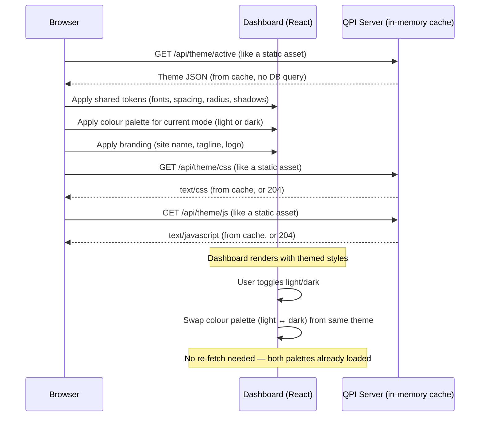

# RFC 0002 — Dashboard Theming

- **Status:** Implemented
- **Author:** Martin Ahindura
- **Created:** 2026-07-23
- **Touches:** `qpi-ui` (Go/PocketBase), dashboard (React/Tailwind v4)
- **Issue:** TBD

## 1. The idea

QPI ships a single, hard-coded dashboard look-and-feel. Every deployment looks
identical — same colours, same logo icon, same "QPI Interface" brand text. For
organisations hosting their own QPI instance, this is limiting: a university lab
wants its crest in the sidebar, a startup wants its brand palette, and some
operators want to go further — injecting custom CSS or even JavaScript to reshape
the dashboard without forking the codebase.

This RFC introduces **runtime-customizable theming**. A superuser creates theme
records in a new PocketBase `themes` collection, activates one, and every user's
dashboard immediately picks up the new look. A theme is **self-contained** — it
carries both light-mode and dark-mode colour palettes so the look is uniform
across modes. Themes carry:

1. **Design tokens** — a JSON object with two colour palettes (light and dark)
   plus shared tokens (fonts, spacing, border-radius, shadows, etc.), applied at
   runtime via CSS custom properties.
2. **Branding assets** — logo image (file upload), site/app name, tagline.
3. **Custom CSS and JavaScript** — raw text fields whose contents are served
   by dedicated API endpoints and loaded by the dashboard in `<style>` /
   `<script>` tags, enabling arbitrarily deep customisation without a
   rebuild.

The dashboard's light/dark toggle switches **which colour palette** within the
active theme is applied — fonts, spacing, branding, and custom CSS/JS stay the
same across both modes.

## 2. Vocabulary

| Term | Meaning |
| --- | --- |
| **Theme** | A record in the `themes` collection holding one complete visual identity: both colour palettes, shared tokens, branding, and custom CSS/JS. |
| **Active theme** | The theme whose `is_active` is `true`. At most one at a time. |
| **Design tokens** | A JSON object whose keys map to CSS custom properties. Colours split into `light` and `dark`; everything else is shared. |
| **Default theme** | `DefaultThemeTokens`, a Go constant — the single source of truth for defaults. The frontend falls back to it, and it pre-populates the admin form. |
| **Cached theme** | The active theme held in PocketBase's in-memory app store and refreshed by collection hooks. Theme endpoints read it rather than the database (§3.2). |
| **Custom CSS** | An admin-authored CSS block served as a virtual stylesheet, loaded after the base styles so it can override anything. |
| **Custom JS** | An admin-authored script served as a virtual script, loaded after the app bundle. |

Custom CSS and JS are shared across modes: they can reference `--qpi-*` properties,
which change per mode on their own.

## 3. Data model

### 3.1 Default theme constant (Go server)

The Go server defines a `DefaultThemeTokens` variable that is the **single
source of truth** for all dashboard defaults. This is a Go struct that:

- Provides the compiled-in CSS custom property fallback values.
- Is served via the `/api/theme/defaults` endpoint so the frontend admin UI
  can pre-populate the theme editor form with these values.
- Matches the exact structure of the `tokens` JSON field (§3.4).
- Is what the theme endpoints return when no theme is active.

```go
// DefaultThemeTokens is the single source of truth for dashboard design tokens.
var DefaultThemeTokens = ThemeTokens{
    Colors: ThemeColors{
        Light: map[string]string{
            "background":        "#f9fafb",
            "surface":           "#ffffff",
            "surface-dim":       "#f3f4f6",
            "surface-container": "#e5e7eb",
            "primary":           "#111827",
            "secondary":         "#6366f1",
            "success":           "#22c55e",
            "warning":           "#eab308",
            "error":             "#ef4444",
            "border":            "#e5e7eb",
        },
        Dark: map[string]string{
            "background":        "#09090b",
            "surface":           "#18181b",
            "surface-dim":       "#131315",
            "surface-container": "#201f22",
            "primary":           "#ffffff",
            "secondary":         "#6366f1",
            "success":           "#22c55e",
            "warning":           "#eab308",
            "error":             "#ef4444",
            "border":            "#27272a",
        },
    },
    Fonts: map[string]string{
        "sans":    "Inter, sans-serif",
        "mono":    "JetBrains Mono, monospace",
        "display": "Geist, sans-serif",
    },
    Spacing: map[string]string{
        "sidebar-width": "240px",
    },
    Radius: map[string]string{
        "sm":   "0.25rem",
        "md":   "0.375rem",
        "lg":   "0.5rem",
        "full": "9999px",
    },
    Shadows: map[string]string{
        "sm": "0 1px 2px rgba(0,0,0,0.05)",
        "md": "0 4px 6px rgba(0,0,0,0.1)",
    },
}

var DefaultThemeBranding = ThemeBranding{
    SiteName: "QPI Interface",
    Tagline:  "Control Hub",
}
```

**File:** `qpi-ui/internal/config/theme_defaults.go` (new file).

### 3.2 In-memory theme cache (app store)

To avoid querying the database on every page load, the active theme is cached
in PocketBase's in-memory app store — the same mechanism used by `AppConfig`
(`SaveConfigOnApp` / `GetConfigFromApp`).

```go
const appStoreActiveThemeKey = "active_theme"

// SaveActiveThemeOnApp caches the active theme in the app store.
// Pass nil to clear the cache and revert to the default theme.
func SaveActiveThemeOnApp(app core.App, theme *db.Theme) {
    if theme == nil {
        theme = GetDefaultThemeRecord() // helper that constructs a Theme from DefaultThemeTokens
    }
    app.Store().Set(appStoreActiveThemeKey, theme)
}

// GetActiveThemeFromApp retrieves the cached active theme.
// This is guaranteed to return a valid theme (falling back to the default theme).
func GetActiveThemeFromApp(app core.App) *db.Theme {
    value := app.Store().Get(appStoreActiveThemeKey)
    if theme, ok := value.(*db.Theme); ok && theme != nil {
        return theme
    }
    // Fallback if cache is completely empty for some reason
    return GetDefaultThemeRecord()
}
```

**Lifecycle:**

1. **Bootstrap (`OnBootstrap`):** after `EnsureSchema`, query the `themes`
   collection for the record with `is_active = true`. If found, call
   `SaveActiveThemeOnApp(app, &theme)`. If not found, call `SaveActiveThemeOnApp(app, nil)`
   which automatically caches the synthesized default theme.
2. **Create/Update hook (`OnThemeUpsert`):** when a theme is saved with
   `is_active = true`, deactivate all other themes in the DB, then cache the
   new active theme via `SaveActiveThemeOnApp`. When a record that was active
   is saved with `is_active = false`, clear the cache by calling `SaveActiveThemeOnApp(app, nil)` (which reverts to the default theme).
3. **Update hook (content change):** when the currently active theme's content
   changes (tokens, CSS, JS, branding, logo), refresh the cache with the
   updated record.
4. **Delete hook (`OnRecordDelete`):** if the deleted theme was the cached active
   theme, call `SaveActiveThemeOnApp(app, nil)` to revert to the default theme.

The theme endpoints therefore read one in-memory pointer rather than querying the
database, which is what makes them as cheap as serving a static file.

### 3.3 `themes` collection schema

One new PocketBase collection: **`themes`**.

| Field | Type | Required | Description |
| --- | --- | --- | --- |
| `name` | text | ✓ | Human-readable theme name (e.g. "Quantum Lab"). |
| `is_active` | bool | | Whether this theme is the currently active one. At most one theme is active at any time. |
| `site_name` | text | | The application name shown in the sidebar brand area. Defaults to `DefaultThemeBranding.SiteName` if empty. |
| `tagline` | text | | Short tagline below the site name (defaults to `DefaultThemeBranding.Tagline`). |
| `logo` | file | | Logo image file upload (PNG/SVG/WEBP, max 2 MB). Falls back to the default Cpu icon if empty. |
| `favicon` | file | | Favicon file upload (ICO/PNG/SVG, max 512 KB). Falls back to the default if empty. |
| `tokens` | json | | Design token object. See §3.4 for structure. Omitted keys inherit from `DefaultThemeTokens`. |
| `custom_css` | text (long) | | Raw CSS injected as a `<style>` block after the base stylesheet. Shared across light and dark modes (can reference `--qpi-*` custom properties that change per mode). |
| `custom_js` | text (long) | | Raw JavaScript injected as a `<script>` block after the app bundle. Shared across modes. |
| `created` | autodate | | |
| `updated` | autodate | | |

### 3.4 Design tokens structure

The `tokens` JSON field mirrors `DefaultThemeTokens` (§3.1) — two colour palettes
plus tokens shared between them, so a theme is fully self-contained:

```jsonc
{
  "colors": {
    "light": { "background": "#f9fafb", "surface": "#ffffff", … },
    "dark":  { "background": "#09090b", "surface": "#18181b", … }
  },
  "fonts":   { "sans": …, "mono": …, "display": … },
  "spacing": { "sidebar-width": "240px" },
  "radius":  { "sm": …, "md": …, "lg": …, "full": … },
  "shadows": { "sm": …, "md": … }
}
```

The keys and their default values are those in §3.1. The frontend always applies
the shared tokens and swaps only `colors.light` or `colors.dark` on toggle. Omitted
keys inherit from `DefaultThemeTokens`.

### 3.5 API rules

The `themes` collection is publicly readable so that the dashboard can style the login modal before authentication. All mutations are admin-only:

- **ListRule / ViewRule:** `""` (publicly readable).
- **CreateRule / UpdateRule / DeleteRule:** `nil` (superuser-only).

The custom theme endpoints (§4.1) are also **public** (no auth), serving theme data
like static file assets from the in-memory cache.

### 3.6 `is_active` uniqueness

At most one theme is active. `OnRecordCreate` / `OnRecordUpdate` enforce it: saving a
theme with `is_active = true` clears the flag on any other. The cache follows the
same hooks — see the lifecycle in §3.2.

## 4. API endpoints

### 4.1 Theme asset endpoints (public, no auth, cached)

These are custom Go handlers registered on the router. They read from the
in-memory app store cache — **no database queries at request time.** They
serve data as if it were static file assets, with appropriate cache headers.

| Method | Path | Content-Type | Response |
| --- | --- | --- | --- |
| GET | `/api/theme/active` | `application/json` | Returns the cached active theme record (without `custom_css` and `custom_js`). Because the cache falls back to the default theme, this always returns a valid theme record. |
| GET | `/api/theme/defaults` | `application/json` | Returns the server's `DefaultThemeTokens` and `DefaultThemeBranding`. Used by the admin form as pre-populated defaults. |
| GET | `/api/theme/css` | `text/css` | Returns the `custom_css` field of the cached active theme. Empty 204 if no active theme or no custom CSS. |
| GET | `/api/theme/js` | `text/javascript` | Returns the `custom_js` field of the cached active theme. Empty 204 if none. |

**Cache headers:**

All theme endpoints include `Cache-Control: public, max-age=300` (5 minutes).
The browser treats them like static assets — fast to load, reasonable
propagation delay when the admin changes the theme. The `/api/theme/defaults`
endpoint can use a longer `max-age` (e.g. 3600) since it only changes on
server version upgrades.

**Design decisions:**

- CSS and JS are served as separate endpoints rather than inline in the JSON
  response so the browser can cache them independently and the `<link>` /
  `<script>` tags work naturally.
- Custom CSS/JS are **shared** across modes — they can reference `--qpi-color-*`
  custom properties which automatically change when the user toggles modes.
  No per-mode CSS/JS endpoints are needed.
- Logo and favicon files are served via PocketBase's built-in file API
  (`/api/files/themes/{id}/{filename}`), which handles caching headers
  automatically.

### 4.2 Admin endpoints (superuser-only)

Theme CRUD uses the standard PocketBase collection REST API
(`/api/collections/themes/records/...`). No custom admin endpoints are needed —
the existing PocketBase CRUD + the collection rules (§3.5) are sufficient.

The collection hooks (§3.6) run server-side on every create/update/delete,
keeping the in-memory cache in sync transparently.

## 5. Frontend integration

### 5.1 Theme loading lifecycle



On boot the dashboard fetches `/api/theme/active`, applies the shared tokens and the
palette matching the current mode (from `localStorage`) — `tokens.colors.light` or
`tokens.colors.dark` — as CSS custom properties on `:root`, sets the branding, and injects the custom CSS and JS as
`<style id="qpi-theme-css">` and `<script id="qpi-theme-js">` in `<head>`. Toggling
modes swaps only the palette — both are already loaded, so nothing is re-fetched.

### 5.2 CSS custom property bridge

The dashboard's `index.css` defines its design tokens as CSS custom properties
that Tailwind v4's `@theme` directive maps to utilities. The defaults come from
the Go server's `DefaultThemeTokens` values (compiled-in):

```css
@theme {
  --color-background: var(--qpi-color-background, #f9fafb);
  --color-surface: var(--qpi-color-surface, #ffffff);
  --color-primary: var(--qpi-color-primary, #111827);
  --color-secondary: var(--qpi-color-secondary, #6366f1);
  /* ... etc. */
  --spacing-sidebar-width: var(--qpi-spacing-sidebar-width, 240px);
  --font-sans: var(--qpi-font-sans, "Inter", sans-serif);
  --font-mono: var(--qpi-font-mono, "JetBrains Mono", monospace);
}
```

The `var(--qpi-*, <default>)` pattern means the dashboard works with its
built-in defaults when no theme is active, and overrides seamlessly when a
theme sets the `--qpi-*` properties. The dark-mode colour swap is done by
the ThemeContext setting different `--qpi-color-*` values when `.dark` is
toggled.

### 5.3 Theme context

A new React context (`ThemeContext`) exposes the active theme and helpers:

```typescript
interface ThemeContextValue {
  theme: ThemeRecord | null;     // the active theme (contains both palettes)
  siteName: string;              // resolved from theme or default
  tagline: string;
  logoUrl: string | null;
  faviconUrl: string | null;
  isDark: boolean;
  toggleMode: () => void;
  isLoading: boolean;
}
```

Components that need branding info (e.g. `Sidebar`, `LoginModal`, the HTML
`<title>`) consume this context instead of hard-coding strings.

### 5.4 ThemeToggle changes

The existing `ThemeToggle` component gains one responsibility: after toggling
the `dark` class, it also tells the `ThemeContext` to swap the colour palette
(from the same theme). Since both palettes are already loaded, this is an
instant client-side operation — no network fetch.

### 5.5 Admin theme management UI

A new section in the existing **Admin Panel** tab lets superusers:

- List all themes with their active status.
- Create / edit a theme: form fields for name, site name, tagline, logo upload,
  and a token JSON editor pre-populated with the server's `DefaultThemeTokens`
  values (fetched from `/api/theme/defaults`), plus text areas for custom CSS
  and JS.
- Toggle a theme as active (with confirmation, since it affects all users).
- Preview a theme before activating it.
- Delete inactive themes.

## 6. Security

### 6.1 Access control

Mutations are superuser-only, reads are public, per the collection rules in §3.5. The
custom endpoints (§4.1) are public handlers serving cached data.

### 6.2 Custom CSS

Custom CSS is admin-authored and served as a static stylesheet. The risk is
minimal — CSS cannot exfiltrate data or execute code (beyond cosmetic damage
like hiding elements). No sanitisation is applied; the admin is trusted.

### 6.3 Custom JS

Custom JavaScript is **more powerful** — it runs in the user's browser with the
same origin as the dashboard, meaning it can access `localStorage`, cookies, and
the PocketBase auth token. This is equivalent to a superuser deploying custom
frontend code.

**Mitigations:**

- **Admin-only creation:** only superusers can write to the `themes` collection
  (API rules, §3.5).
- **Audit trail:** PocketBase's built-in audit log captures who created/updated
  each theme.
- **Opt-in:** the `custom_js` field is optional. Deployments that don't need it
  simply leave it empty.
- **CSP header (recommended):** operators can add a Content-Security-Policy
  header that restricts `script-src` to `'self'`, which would block inline
  scripts. However, since the JS is served from a same-origin endpoint, a
  stricter CSP would need a nonce or hash — a future enhancement if needed.

The philosophy is the same as PocketBase's own admin JS hooks or any CMS
template system: the admin is trusted to not inject malicious code into their
own application.

### 6.4 File uploads

Logo and favicon uploads are constrained by:

- **MIME types:** `image/png`, `image/svg+xml`, `image/webp`, `image/x-icon`.
- **Max size:** logo 2 MB, favicon 512 KB.
- **No execution:** images are served with their actual content type; no path
  traversal is possible (PocketBase handles this).

## 7. What exists today, and what changes

### Today

- **Colours** are hard-coded in `tailwind.config.js` (dark-only palette:
  `background: #09090b`, `surface: #18181b`, etc.) and in `index.css` as
  Tailwind `@layer base` / `dark:` variants.
- **Dark/light toggle** is a `localStorage`-backed class toggle
  (`ThemeToggle.tsx`), flipping `.dark` on `<html>`. The toggle only switches
  Tailwind's `dark:` variant; there is no concept of distinct palettes.
- **Branding** is hard-coded in `Sidebar.tsx` ("QPI Interface", "Control Hub",
  `Cpu` icon) and in `index.html` (`<title>QPI Dashboard — Obsidian
  Precision</title>`).
- **No custom CSS/JS injection** exists.
- **No single source of truth** for design defaults — values are scattered
  across `tailwind.config.js`, `index.css`, and component files.

### After

§3–§6 describe the result. The guarantee worth stating separately: **the dashboard
works identically with zero themes configured** — every CSS custom property has a
compiled-in default from `DefaultThemeTokens`, and branding falls back to
`DefaultThemeBranding`.

## 8. Decisions

Why each mechanism, rather than what it does (§3–§6 cover that):

1. **Runtime CSS custom properties, not Tailwind recompilation.** Recompiling would
   need a Node.js build step on the server. The cost is that only token *values* are
   overridable, not arbitrary utilities — which `custom_css` covers.

2. **Separate CSS/JS endpoints, not inline in JSON.** The browser caches them
   independently, `<link>` and `<script>` work naturally, and `/api/theme/active`
   stays small.

3. **Both palettes in one record.** Keeps a theme's identity uniform across modes and
   avoids a `category` field and a more complicated `is_active` hook.

4. **Defaults defined in Go.** The frontend fallbacks, the admin form's initial values
   and the no-active-theme behaviour all derive from `DefaultThemeTokens`, so backend
   and frontend cannot drift.

5. **Cache in the app store.** The database is read once at bootstrap and on admin
   mutations, never per request.

6. **Custom CSS/JS shared across modes.** The toggle only changes colour properties,
   so custom code that references `--qpi-color-*` follows the mode for free.

7. **Custom JS opt-in, unsandboxed.** The power it gives matches the trust already
   placed in a superuser. No iframe or Web Worker in v1.

8. **Logo and favicon as PocketBase file fields.** Reuses its storage, thumbnailing
   and serving rather than inventing an upload flow.
