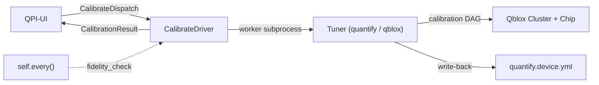
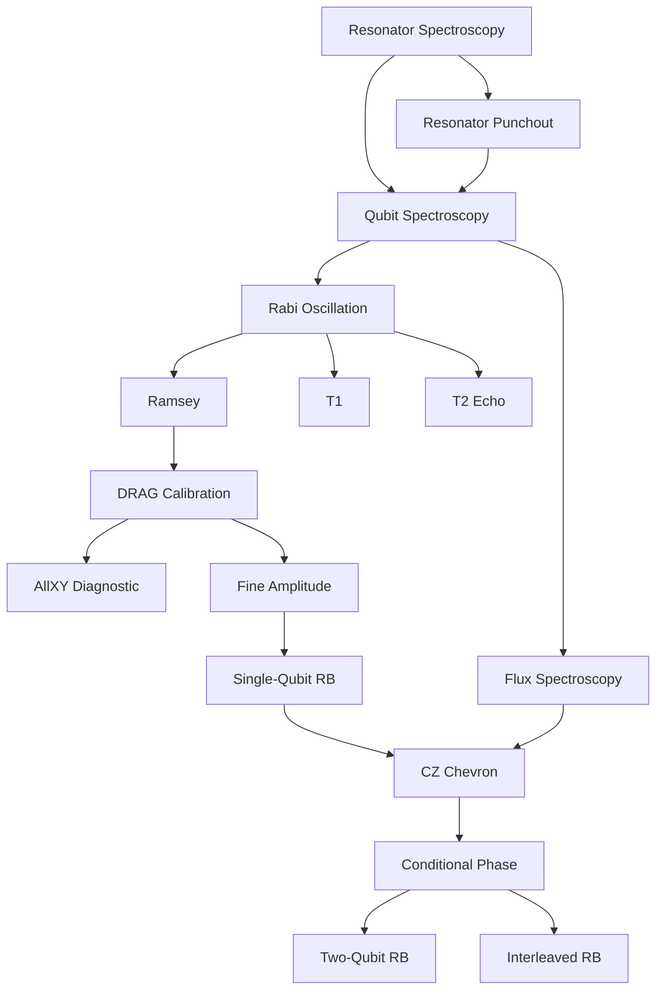

# RFC 0004 — Calibration Tuners

- **Status:** Accepted — implemented except where §7 and §9 say otherwise
- **Author:** Martin Ahindura
- **Created:** 2026-07-30
- **Depends on:** RFC 0001 (driver framework, events), RFC 0003 (operations and devices)
- **Touches:** `qpi-driver` (Python **and**, for the operation enum, Go and
  TypeScript), `qpi-ui` (Go/PocketBase), dashboard (React)

## 1. The idea

Superconducting transmon qubits suffer from continuous parameter drift (qubit
frequencies, pulse amplitudes, coherence times) on timescales of minutes to
hours due to TLS fluctuations, thermal variations, and magnetic flux noise.
Today, qpi can **store** calibration parameters in `quantify.device.yml` and
**execute circuits** through the `process` operation, but it has no mechanism to
**produce or maintain** those parameters. A lab operator must run calibration
experiments externally, manually update the YAML, and hope parameters haven't
drifted by the time jobs run.

This RFC adds a third operation — `calibrate` — and two devices,
`quantify_tuner` (using quantify-scheduler) and `qblox_tuner` (using
qblox-scheduler), that automate the full calibration lifecycle from initial
bring-up through continuous drift recalibration for superconducting transmon
chips with flux-tunable couplers on the Qblox hardware stack.

## 2. Vocabulary

| Term | Meaning |
| --- | --- |
| **Tuner** | The calibration backend, analogous to `Executor` for `process`. A `Tuner` runs calibration routines against a `QuantumDevice` and updates its parameters. |
| **Routine** | A single calibration experiment (e.g. Rabi, Ramsey, T1). Routines are nodes in a dependency DAG. |
| **Calibration DAG** | The directed acyclic graph of routine dependencies. A full calibration walks the DAG in topological order. |
| **Fidelity check** | A lightweight benchmarking pass (quick RB) used for periodic drift detection. |

## 3. Background & academic references

The calibration workflow for transmon qubits is well-established in the
literature and follows a structured dependency graph:

| # | Experiment | Depends on | Calibrates | Reference |
|---|-----------|------------|------------|-----------|
| 1 | Resonator Spectroscopy | — | Resonator frequency $f_r$ | [Koch et al., PRA 2007](https://arxiv.org/abs/cond-mat/0703002) |
| 2 | Resonator Punchout | 1 | Optimal readout power | [Qibocal docs](https://qibo.science/qibocal/stable/) |
| 3 | Qubit Spectroscopy (Two-Tone) | 1, 2 | Qubit frequency $f_{01}$ | [Schuster et al., Nature 2007](https://www.nature.com/articles/nature05461) |
| 4 | Rabi Oscillation | 3 | $\pi$-pulse amplitude (`amp180`) | [Vion et al., Science 2002](https://www.science.org/doi/10.1126/science.1069372) |
| 5 | Ramsey Interferometry | 4 | Fine $f_{01}$, $T_2^*$ | [Ramsey, Phys. Rev. 1950](https://journals.aps.org/pr/abstract/10.1103/PhysRev.78.695) |
| 6 | $T_1$ Measurement | 4 | Relaxation time $T_1$ | — |
| 7 | $T_2$ Echo (Hahn/CPMG) | 4 | Dephasing time $T_2$ | [Bylander et al., Nature Physics 2011](https://www.nature.com/articles/nphys1994) |
| 8 | DRAG Calibration | 5 | Motzoi parameter $\beta$ | [Motzoi et al., PRL 2009 (arXiv:0901.0534)](https://arxiv.org/abs/0901.0534) |
| 9 | AllXY Diagnostic | 8 | Validates 1Q gate params | [Reed, PhD thesis, Yale 2013](https://rsl.yale.edu/sites/default/files/files/RSL_Theses/reed.pdf) |
| 10 | Fine Amplitude Cal. | 8 | Sub-% amplitude correction | — |
| 11 | Single-Qubit RB | 10 | 1Q gate fidelity $F_{1Q}$ | [Magesan et al., PRL 2011 (arXiv:1009.3639)](https://arxiv.org/abs/1009.3639) |
| 12 | Flux Spectroscopy | 3 | Coupler freq. vs. flux | — |
| 13 | CZ Chevron | 11, 12 | CZ amp/duration | [DiCarlo et al., Nature 2009](https://www.nature.com/articles/nature08121) |
| 14 | Conditional Phase | 13 | CZ $\phi_{\text{cond}} = \pi$ | [Sung et al., PRX 2021 (arXiv:2011.01261)](https://arxiv.org/abs/2011.01261) |
| 15 | Two-Qubit RB | 14 | 2Q gate fidelity $F_{2Q}$ | [Magesan et al., PRA 2012 (arXiv:1109.6887)](https://arxiv.org/abs/1109.6887) |
| 16 | Interleaved RB (CZ) | 14 | CZ-specific fidelity | [Magesan et al., PRL 2012 (arXiv:1203.4550)](https://arxiv.org/abs/1203.4550) |

The three RB citations are deliberately distinct and easy to conflate: 1009.3639
is the scalable-and-robust RB protocol (PRL 106, 180504), 1109.6887 is the
general multi-qubit characterisation framework the fidelity formula comes from
(PRA 85, 042311), and 1203.4550 is interleaved RB (PRL 109, 080505).

Recent advances in automated calibration:

- **Millisecond-Scale Calibration** ([arXiv:2602.11912](https://arxiv.org/abs/2602.11912)): On-FPGA
  calibration loops achieving 74,000 recalibrations over 6 hours with >99.9%
  single-qubit fidelity. *(Preprint, unverified at time of writing — confirm the
  identifier and the quoted figures before this RFC leaves Draft. Nothing in the
  design below depends on it; it is cited as motivation only.)*
- **CMA-ES Optimization** ([arXiv:2509.08555](https://arxiv.org/abs/2509.08555)): CMA-ES outperforms
  Nelder-Mead for high-dimensional pulse optimization.
- **End-to-End Framework** ([arXiv:2501.17825](https://arxiv.org/abs/2501.17825)): Theoretical framework
  linking hardware design to calibration optimization.
- **Qibocal** ([qibo.science](https://qibo.science/qibocal/stable/)): Open-source automated calibration
  with runcard-defined DAGs — the closest existing framework.

## 4. Decisions

Recorded here rather than in a separate ADR, per the RFC conventions.

| Decision | Resolution |
|----------|-----------|
| Device naming | `quantify_tuner` (quantify-scheduler) and `qblox_tuner` (qblox-scheduler) |
| Event type | New `CALIBRATION_RESULT` — structurally different from `JOB_RESULT` |
| YAML write-back | Driver-only (local). QPI-UI does not manage calibration files |
| Trigger model | Both: QPI-UI dispatches `CalibrateDispatch` + driver self-schedules periodic fidelity checks |
| v1 scope | Full DAG (steps 1–16), individually disableable |
| Package location | New `tuners/` at same level as `executors/`, mirroring its structure |
| Dispatch transport | A `calibration_requests` collection the existing driver dispatcher polls — **not** a direct socket write from an HTTP handler. §6.8 |
| Result persistence | A `calibration_results` collection. This reverses an earlier decision here in favour of the events log; §6.8 records why. |
| pyproject.toml | Alias extras `quantify_tuner`/`qblox_tuner` pointing at the scheduler extras, following the existing `qiskit_aer = ["qpi-driver[aer]"]` precedent; the fitting dependencies go into the `quantify` and `qblox` extras themselves. §6.9 |

### Why a new operation rather than a new device

`calibrate` is a third value in an enum RFC 0003 §13.1 calls closed on purpose:
every value needs a server-side handler, so growing it is a coordinated change
across three SDKs and QPI-UI (§6.1 lists the whole blast radius). That cost is
worth paying only because the two alternatives are worse:

- **A `process` device.** The contract of `process` is "a job is pushed to you,
  you emit a `JobResult`", and a job is a user-submitted circuit that bills
  against that user's QPU seconds. A calibration run bills nobody, produces no
  counts, and takes hours. It would have to be smuggled through `quantum_jobs`
  with a sentinel payload, and every consumer of the jobs collection — the
  scheduler, the billing deduction in `handleDriverJobResult`, the dashboard's
  job list — would need to learn to skip it.
- **A `monitor` device.** A monitor never handles an inbound event
  (`BlueforsGen1Driver.handle_event` logs and drops everything). Calibration is
  triggered as well as scheduled, so it needs the inbound half.

The distinguishing property is genuinely the *contract*, not the backend, which
is exactly what RFC 0003 says an operation is.

**Rejected.** *Writing calibration parameters back through QPI-UI*: the device
YAML is read by the `process` driver on the same node, so a round trip through
the server would add a network partition between a file's two local users for no
gain. *Deriving the DAG from the routines' `depends_on` alone at import time*: it
is derived from them, but the enabled set comes from `calibration.yml`, so the
graph is built per run rather than once per process. *One set of routines per
scheduler*: the two expose the same gate vocabulary, so the duplication buys
nothing and costs a second copy to keep in step — §6.2 records what to do with
the differences that are real.

## 5. How it works



1. **Dispatch** (QPI-UI or periodic timer): A `CalibrateDispatch` event reaches
   the driver with a mode (`full`, `partial`, `fidelity_check`) and optional
   target qubits/edges.
2. **Worker**: The driver drops the request onto a job queue. A subprocess
   running the `Tuner` picks it up.
3. **DAG walk**: The tuner builds a `CalibrationDAG` from the enabled routines,
   topologically sorts it, and runs each routine: build schedule → compile →
   acquire → fit → apply → persist.
4. **Report**: A `CalibrationResult` event is emitted back with per-qubit
   parameters, benchmarks, and status.
5. **Drift monitoring**: If `drift_check_interval > 0`, the driver uses `self.every()`
   to run periodic lightweight RB checks. If fidelity drops below threshold, a
   partial recalibration is triggered automatically.

### The full calibration DAG



## 6. Implementation

The changes span both the Python driver (`qpi-driver/py`) and the Go server
(`qpi-ui`).

### 6.1 New operation & event types

An operation is closed across *all three* SDKs and the server (RFC 0003 §8,
§13.1), and the event-type list is closed in the same way. Adding `calibrate`
is therefore not a Python-only change; every row below is required for the
build to stay green, and several are guarded by tests that assert the current
sets are exactly what they are.

| Where | Change | Note |
|-------|--------|------|
| `qpi-driver/py/qpi_driver/builtins/registry.py` | `CALIBRATE = "calibrate"` on `Operation` | `_DEVICES` is built per operation, so this alone opens the registry slot |
| `qpi-driver/py/qpi_driver/events.py` | `CALIBRATE_DISPATCH`, `CALIBRATION_RESULT` on `EventType` | |
| `qpi-driver/go/devices` | `Calibrate` const, `Operations()`/`OperationNames()` | `TestOperationsAreAClosedPair` in `devices_test.go` asserts a *pair*; it becomes a triple |
| `qpi-driver/go/events.go` | `CalibrateDispatch`, `CalibrationResult` | |
| `qpi-driver/js/src/devices.ts` | `Operation.Calibrate` and the `allOperations` array | same closed-set assertion as Go |
| `qpi-driver/js/src/events.ts` | the two event types | |
| `qpi-ui/internal/drivers/drivers.go` | `Calibrate Operation = "calibrate"`, `QuantifyTuner`/`QbloxTuner` `Kind` consts | |
| `qpi-ui/internal/drivers/catalog.go` | `eventCalibrateDispatch`/`eventCalibrationResult`, a `calibrateOptions()` helper mirroring `processOptions()`, and the two specs | `Languages: []Language{Python}` — no other SDK ships a tuner |
| `qpi-ui/internal/api/schema.go` | both types in the `EventType` consts **and in `AllEventTypes`** | driver registration validates a driver's chosen events against this list, and `drivers_test.go` asserts every catalog event name has a handler |
| `qpi-ui/internal/api/nng_driver.go` | `registry.Register(EventCalibrationResult, handleCalibrationResult)` | |
| `README.md`, `docs/driver/operations.md` | the two-operation prose | both currently enumerate `process` and `monitor` as the whole set |

Neither the Go nor the TypeScript SDK ships a tuner device — as with `process`,
they gain the operation name and must say plainly that they ship no devices for
it (RFC 0003 §8) rather than report an empty list.

### 6.2 Tuners package (`qpi_driver/tuners/`)

Mirrors the `executors/` structure, with one deliberate difference: **there is
one set of routines, not one per scheduler.**

quantify-scheduler and qblox-scheduler expose the same gate vocabulary — `Rxy`,
`X`, `Reset`, `Measure`, `CZ`, `IdlePulse`, `SquarePulse`, `SetClockFrequency` —
under two import paths. A routine composed against that vocabulary is therefore
backend-agnostic already, and a per-backend copy would be sixteen more files to
keep in step for no gain. Two seams carry everything that genuinely differs:

- **`base/backend.py`** — a `SchedulerBackend` binds one scheduler's operation
  classes and knows how to turn a finished schedule into a dataset. quantify
  compiles and drives an instrument coordinator; qblox hands the schedule to a
  `HardwareAgent`. That is the whole of the difference in execution.
- **`base/device.py`** — the device models are not the same shape. quantify
  builds on qcodes, where a parameter is callable (`element.rxy.amp180()`);
  qblox uses pydantic, where it is a plain attribute. They also disagree on
  names: the DRAG coefficient is `motzoi` in one and `beta` in the other. A
  routine names the concept and this module finds whichever the device has.

```
qpi_driver/tuners/
├── __init__.py                    # Tuner, resolve_tuner()
├── base/
│   ├── __init__.py                # Tuner ABC — the DAG walk and write-back live here
│   ├── backend.py                 # SchedulerBackend: the operations a routine composes
│   ├── config.py                  # CalibrationConfig (from calibration.yml)
│   ├── dag.py                     # CalibrationDAG — graph, topological sort, the walk
│   ├── device.py                  # Reading/writing device parameters across both models
│   ├── report.py                  # CalibrationReport, RoutineResult, BenchmarkResult
│   └── routines.py                # CalibrationRoutine ABC
├── routines/                      # ONE set, shared by every tuner
│   ├── __init__.py                # ROUTINE_CLASSES, all_routines(), routine_names()
│   ├── spectroscopy.py            # resonator, punchout, qubit, flux
│   ├── single_qubit.py            # rabi, ramsey, t1, t2_echo, drag, allxy, fine_amplitude
│   ├── two_qubit.py               # cz_chevron, conditional_phase
│   └── benchmarks.py              # rb, interleaved_rb, allxy_check
├── quantify/__init__.py           # QuantifyTuner + QuantifyBackend
├── qblox/__init__.py              # QbloxTuner + QbloxBackend
├── fitting/                       # Backend-agnostic curve fits
│   ├── __init__.py
│   ├── core.py                    # FitError, range guards, dataset access
│   ├── lorentzian.py              # spectroscopy, punchout
│   ├── cosine.py                  # rabi, ramsey, drag, fine amplitude
│   ├── exponential.py             # t1, t2, RB decay
│   └── chevron.py                 # CZ chevron, conditional phase
└── utils/
    ├── __init__.py
    ├── persistence.py             # Verified, atomic YAML write-back (§10)
    └── clifford.py                # The single-qubit Clifford group, for RB
```

A tuner therefore supplies a backend and a device, and inherits the DAG walk,
the routines, the fitting and the write-back. Adding a third scheduler is a
`SchedulerBackend` and a `Tuner`; it is not sixteen more experiments.

### 6.3 Tuner abstract base class

```python
class Tuner(ABC):
    """Runs calibration routines against a quantum device and updates it."""

    def __init__(self, name: str, **kwargs): ...

    @property
    @abstractmethod
    def backend(self) -> SchedulerBackend: ...

    @property
    @abstractmethod
    def device(self) -> Any: ...

    def calibrate(self, config: CalibrationConfig) -> CalibrationReport: ...
    def recalibrate(self, qubits: list[str], config: CalibrationConfig) -> CalibrationReport: ...
    def check_fidelity(self, config: CalibrationConfig) -> CalibrationReport: ...
    def close(self) -> None: ...
```

The three entry points are the same DAG walk over different subsets — the whole
enabled graph, the routines downstream of some qubits, the benchmarks alone — so
they are implemented once on the base class rather than per tuner.

`check_fidelity` returns a `CalibrationReport` rather than a bare
`dict[str, float]` so that every mode emits the same payload shape;
`CalibrationReport.fidelities()` is what reduces it to the per-target numbers a
threshold is compared against, taking the worst protocol per target because a
drift check should fire on the worst evidence it has.

### 6.4 Calibration routine interface

```python
class CalibrationRoutine(ABC):
    """One node in the calibration DAG."""

    name: str
    depends_on: tuple[str, ...] = ()
    targets: Literal["qubits", "edges"] = "qubits"
    updates: tuple[str, ...] = ()      # device parameters written
    benchmark: bool = False            # whether its result is a gate fidelity

    @abstractmethod
    def build_schedule(self, target, device, config, backend) -> Schedule: ...

    @abstractmethod
    def analyse(self, dataset, target, device, config) -> dict[str, Any]: ...

    def apply(self, device, target, params) -> None: ...
```

`benchmark` is declared rather than inferred from an empty `updates`: T1 writes
no device parameter either, and recording it as a benchmark would put a `None`
fidelity in front of the drift check.

`analyse` **raises** rather than returning zeros when it cannot fit. This is the
difference between a calibration that fails and one that quietly writes
`t1 = 0.0` to the device as though it had measured it.

### 6.5 CalibrateDriver (`builtins/calibrate.py`)

Follows `QpuDriver`'s subprocess-isolation pattern:

```python
CALIBRATE_DEVICES = ("quantify_tuner", "qblox_tuner")

class CalibrateDriver(QpiDriver):
    """Calibrates transmon qubits via a tuner backend, emitting CalibrationResult events."""

    def __init__(self, *, tuner, calibration_config, drift_check_interval=0,
                 fidelity_threshold=0.999, fidelity_2q_threshold=0.99, ...):
        ...
        if drift_check_interval > 0:
            self.every(drift_check_interval, self._check_fidelity)

    def handle_event(self, event):
        if event.type is EventType.CALIBRATE_DISPATCH:
            self._job_queue.put(event.payload)
        else:
            log.warning(
                "dropping event %s: calibrate driver does not handle %s",
                event.id,
                event.type.value,
            )

    def _check_fidelity(self):
        """Periodic lightweight RB; triggers recalibration on drift."""
        self._job_queue.put({"mode": "fidelity_check"})
```

Registering the timer in `__init__` is safe even though `_job_queue` is created
in `_on_start`: `QpiDriver.run` calls `_on_start()` before `_start_periodic()`,
which is the same order `BlueforsGen1Driver` relies on.

Unlike a QPU's worker, this one is long-running per item — a full DAG walk is
hours, not seconds. Two consequences the implementation has to face rather than
inherit: `_on_stop`'s two-second join before `terminate()` will always time out
mid-calibration, so the poison pill needs a cooperative cancellation check
between routines if a clean stop is to mean anything; and a routine that hangs
on an instrument has no `job_timeout` equivalent, so the per-routine timeout
belongs in `calibration.yml` (§6.6).

Key `-o` options:

| Option | Default | Description |
|--------|---------|-------------|
| `quantify_device_config` | `./quantify.device.yml` | Device calibration YAML |
| `quantify_hardware_config` | `./quantify.hardware.json` | Hardware connectivity config |
| `calibration_config` | `./calibration.yml` | Routines, sweep ranges, thresholds |
| `drift_check_interval` | `0` (disabled) | Seconds between periodic RB fidelity checks |
| `fidelity_threshold` | `0.999` | 1Q gate fidelity recalibration trigger |
| `fidelity_2q_threshold` | `0.99` | 2Q gate fidelity threshold |
| `is_dummy` | `false` | Use dummy Qblox cluster |

Named `drift_check_interval` rather than `monitor_interval` because `monitor` is
already an operation, and an option on a `calibrate` device that appears to name
a different operation is the kind of collision this vocabulary is careful about
(§2, RFC 0003 §2). The three `-o` keys shared with `process` — the two quantify
paths and `is_dummy` — keep their existing names and defaults deliberately: a
tuner and the QPU beside it read the same two files, and an operator who had to
spell the same path two different ways would eventually spell it two different
values.

All of them have working defaults, so — as with `process` — a tuner starts with
no `-o` at all, and a missing `calibration.yml` is the error that surfaces
first. Reading an option is what declares it (RFC 0003 §13.6), so the catalog's
`calibrateOptions()` must list exactly the keys `build_from_options` reads: an
option nothing reads is rejected at startup, so a key in the catalog and not in
the builder turns a generated snippet into a driver that refuses to launch.

### 6.6 Calibration config (`calibration.yml`)

```yaml
target_qubits: [q0, q1, q2]
target_edges: [q0_q1, q1_q2]

# Per-routine wall-clock ceiling. The `process` operation's job_timeout has no
# equivalent here — a routine that hangs on an instrument would otherwise hang
# the worker for the life of the driver.
routine_timeout_s: 900

routines:
  resonator_spectroscopy:
    freq_range: [5.8e9, 6.5e9]
    freq_step: 0.5e6
    readout_power_dbm: -30
  rabi:
    amp_range: [0.0, 0.5]
    amp_step: 0.005
  ramsey:
    delay_range: [4e-9, 10e-6]
    n_points: 50
    artificial_detuning: 1e6
  # ... (all 16 routines configurable)

monitoring:
  rb_depths: [1, 10, 50]
  n_circuits_per_depth: 10
  shots: 512
  allxy_as_smoke_test: true
```

### 6.7 Benchmarking

Benchmarking routines sit at the leaves of the DAG. They produce fidelity
metrics but don't update device parameters.

**Randomized Benchmarking** (protocol per [Magesan et al., PRL 2011](https://arxiv.org/abs/1009.3639),
fidelity formula per [Magesan et al., PRA 2012](https://arxiv.org/abs/1109.6887)):
generate random Clifford sequences of depths $m$, append inverse Clifford, fit
survival probability $p(m) = A \cdot r^m + B$, compute fidelity
$F = 1 - \frac{(1-r)(d-1)}{d}$ where $d = 2^n$ — so $d = 2$ for single-qubit and
$d = 4$ for two-qubit.

**Interleaved RB** (per [Magesan et al., PRL 2012](https://arxiv.org/abs/1203.4550)):
interleave a target gate (e.g. CZ) between random Cliffords to isolate its
error rate.

### 6.8 Go server (`qpi-ui`)

The event-type constants and catalog entries are listed in §6.1. What follows is
the mechanism, which is where this operation differs from the two that exist.

#### Dispatching a calibration

**A driver's PUSH socket is not reachable from an HTTP handler.** It is a local
variable inside `runDriverDispatcher`, one goroutine per connected driver, and
the only thing that goroutine sends is whatever `scheduler.FetchNextJob` hands
it. `activeDrivers` holds a `context.CancelFunc` per driver and nothing else —
there is no registry of sockets or channels to write to. So "push a
`CalibrateDispatch` onto the driver's socket" from a route handler is not a
small addition; it is a new outbound path.

Two ways to build it:

1. **A queue collection the dispatcher polls** — the recommended one. A
   `calibration_requests` collection with `driver`, `mode`, `target_qubits`,
   `target_edges` and `status`, plus a `FetchNextCalibration(app, driverID)`
   mirroring `FetchNextJob`. `runDriverDispatcher` selects between the two
   sources and wraps whichever it gets in the matching event. This inherits, for
   free, everything the job path already solved: the request survives a server
   restart, a failed `sock.Send` can flip it back to `pending` exactly as a job
   is requeued, and a calibration requested while the driver is offline runs when
   it reconnects instead of being dropped on the floor. Given a calibration is
   the *slowest* thing in the system, losing one silently is the worst failure
   mode available.
2. **An in-memory channel per driver**, registered beside `activeDrivers` and
   selected on in the dispatcher loop. Less code, but a request is lost on
   restart, on a send error, and whenever the driver is not currently attached —
   and it introduces a second, differently-shaped outbound mechanism.

This RFC takes (1). The HTTP surface stays as sketched but is a plain create
against the queue, not a socket write:

```
POST /api/op/calibrate/dispatch    (admin-only — see §10)
{
    "driver_id": "...",
    "mode": "full",
    "target_qubits": ["q0"],
    "target_edges": ["q0_q1"]
}
```

A driver already busy with a calibration should not be handed a second one: the
worker is single-threaded and a queued `full` run behind a `full` run is almost
never what the operator meant. The dispatcher skips a driver with a request
already in `running`.

#### Receiving a result

`handleCalibrationResult` validates the payload — as `handleCryostatReading`
rejects a reading with no readings, this rejects a report with no mode or status
— and stores it in a `calibration_results` collection, attributed to both the
driver that sent it and the QPU that driver belongs to.

**Why a collection rather than the events log.** An earlier version of this RFC
deferred it: `CryostatReading` appends to the shared `events` trace log and
creates no per-type collection, and a new collection costs a model, a migration,
a config key and access rules. Two things settled it the other way. The dashboard
panel below is a *history list* and a *fidelity trend*, which is a query over
months of reports rather than a tail of recent events — exactly the case the
deferral named as the trigger for promoting it. And retention is different in
kind: a calibration report is far larger and far rarer than a cryostat reading,
so the events log's prune policy, tuned for a monitor emitting every few seconds,
would discard the reports on entirely the wrong schedule. Sharing the log would
have meant a second retention rule inside it, which is most of a collection
without the query.

The full cost is therefore paid, and is: a `CalibrationResult` model in
`internal/db/models.go` with the struct tags the migrator reads, a collection in
`internal/db/migrate.go`, `DefaultCalibrationResultsCollection` plus its flag and
its `GetCollectionName` case in `internal/config/config.go`, and
authenticated-read/superuser-CUD access rules.

| Field | Type | Description |
|-------|------|-------------|
| `driver` | relation | Driver that produced this result |
| `qpu` | relation | QPU that driver belongs to |
| `timestamp` | date | When the calibration completed |
| `duration_s` | number | How long it took |
| `mode` | text | `"full"`, `"partial"`, or `"fidelity_check"` |
| `backend` | text | Which scheduler ran it |
| `routine_results` | json | Per-routine, per-target fitted parameters |
| `benchmarks` | json | Fidelity metrics |
| `errors` | json | What failed, per routine and target |
| `status` | text | `"success"`, `"partial_failure"`, `"failed"` |

The payload's fields are **flat**, beside `job_id` — the handler unmarshals the
event payload straight into `CalibrationResultPayload`. Nested under a `results`
key it parses without error and leaves every field at its zero value, saving a
blank row for a calibration that really ran; a test asserts the shape in both
languages.

A report also closes out the queued request it answers, which is what lets the
dispatcher offer the next one.

#### Dashboard (v1 — minimal)

An admin-only Calibration tab reading `calibration_results` for what the chip
looks like and `calibration_requests` for whether something is running. The two
are separate for a reason: a calibration takes hours, and the queued request is
the only thing that can say "in progress" during the gap before a report exists.

It shows measured fidelity per target, the current parameters, and the run
history, and it queues a calibration through the endpoint above. Three details
are load-bearing rather than cosmetic:

- **Each target is judged against the threshold that governs it** — the
  two-qubit one for an edge, the one-qubit one for a qubit. A CZ an order of
  magnitude worse than a single-qubit gate is normal; holding it to the 1Q
  threshold would make the panel cry wolf and train operators to ignore it.
- **Parameters are grouped by qubit, not by routine.** "What does q0 look like
  now" is the question an operator has; a routine spans every target while a
  target spans only a handful of routines.
- **The trigger modal defaults to the drift check**, not the full run. It is the
  common case, it is cheap, and it changes nothing — whereas a mis-clicked full
  calibration costs hours of QPU time.

Trend graphs, drift plots and live DAG progress are still deferred.

One incidental thing settled while there: the `QPU` interface carried a
`calibration_data?: unknown` field that no collection on the server has —
vestigial, and removed rather than quietly repurposed as this feature's hook.

### 6.9 Dependencies

Add `scipy>=1.11` and `lmfit>=1.3` to the existing `quantify` and `qblox` extras
in `pyproject.toml` — the fitting code is imported by both tuners, and neither
tuner is usable without its scheduler anyway.

Add alias extras `quantify_tuner = ["qpi-driver[quantify]"]` and
`qblox_tuner = ["qpi-driver[qblox]"]`, following the existing
`qiskit_aer = ["qpi-driver[aer]"]` precedent, so the extra an operator installs
matches the `--device` they were given. `Spec.Extra` in the catalog names these,
which is what the generated setup snippet pastes.

## 7. Testing strategy

### Tier 1: Fitting unit tests (no simulator)

Generate synthetic data with `numpy` using known analytic forms + Gaussian
noise, verify fits recover known parameters within tolerance. This is the bulk
of testing and validates the most error-prone component.

### Tier 2: Schedule compilation tests (dummy Cluster)

Use the dummy Cluster from `qblox-instruments` to verify each routine's
`build_schedule()` produces a valid, compilable `Schedule`. The dummy Cluster
returns all-zeros — this validates compilation, not analysis.

### Tier 3: Physics simulation (optional, scqubits) — not yet implemented

Use [scqubits](https://scqubits.readthedocs.io/) (BSD-3) to generate physically
realistic synthetic acquisition data, so a routine can be tested end to end —
schedule, acquisition, fit, write-back — without hardware. Tests requiring it
would be marked `@pytest.mark.scqubits` and skipped when it is absent.

This is the gap between "the fits are correct and the schedules compile", which
tiers 1 and 2 establish, and "the routines measure what they claim to", which
only hardware or a physical simulation can. §9's manual verification is the
other half of that answer.

### Test files

`make test-py` (Makefile:123) runs one target per extra — `base`, `cli`, `aer`,
`quantify`, `qblox` — each in its own environment, so *which* environment a test
can run in is a property of the test, not a detail. Tier 1 imports nothing
vendor-specific and belongs in the base environment; tiers 2 and 3 need a
scheduler and belong with the extra that ships it. The last column below is
therefore part of the design, not bookkeeping:

| Test file | Tier | Runs under | Tests |
|-----------|------|------------|-------|
| `tests/test_calibration_dag.py` | 1 | `test-py-base` | DAG topological sort, cycle detection, partial DAG |
| `tests/test_calibration_config.py` | 1 | `test-py-base` | Config parsing, defaults, validation |
| `tests/test_fitting.py` | 1 | `test-py-base` | All fitting functions against synthetic data |
| `tests/test_persistence.py` | 1 | `test-py-base` | YAML write-back round-trip |
| `tests/test_clifford.py` | 1 | `test-py-base` | Clifford group generation + inverse correctness |
| `tests/test_calibrate_driver.py` | 1 | `test-py-base` | Driver event handling, worker lifecycle — over a stub `Tuner`, no scheduler |
| `tests/test_tuner_routines.py` | 2 | `test-py-quantify` + `test-py-qblox` | Schedule compilation for each routine |

Keeping the driver's own tests in tier 1 is what makes `CalibrateDriver`
testable without a lab: the tuner is resolved by name, class *or instance*
(mirroring `resolve_executor`), and a builder that returns an unstarted driver
(RFC 0003 §7) means the whole event path can be asserted with no server and no
hardware.

There is no `make test-py-calibrate` target to add. The tier-1 files run under
`test-py-base`, the tier-2 file runs under the two existing scheduler targets,
and adding a sixth target would mean a sixth environment that installs a
scheduler in order to run tests that do not need one. §9 is corrected to match.

## 8. CLI usage

```bash
# Full calibration (quantify-scheduler)
qpi-driver start --operation calibrate --device quantify_tuner \
    -o quantify_device_config=./quantify.device.yml \
    -o quantify_hardware_config=./quantify.hardware.json \
    -o calibration_config=./calibration.yml \
    -o is_dummy=true

# Full calibration (qblox-scheduler)
qpi-driver start --operation calibrate --device qblox_tuner \
    -o quantify_device_config=./quantify.device.yml \
    -o quantify_hardware_config=./quantify.hardware.json \
    -o calibration_config=./calibration.yml

# With periodic drift monitoring (every 30 min)
qpi-driver start --operation calibrate --device quantify_tuner \
    -o drift_check_interval=1800 \
    -o fidelity_threshold=0.999 \
    -o fidelity_2q_threshold=0.99
```

A tuner registers as its own driver, separate from the QPU driver on the same
node, exactly as a cryostat monitor does (RFC 0001 §4). The two share the
device YAML through the filesystem and nothing else — which is the whole of the
write-back contract, and the reason §10 treats that file as the trust boundary.

## 9. Verification plan

### Automated tests

```bash
make test-py-base        # Fitting, DAG, config, Clifford, persistence, driver lifecycle
make test-py-quantify    # quantify_tuner routine compilation (dummy Cluster)
make test-py-qblox       # qblox_tuner routine compilation (dummy Cluster)
make test-go             # Event routing, handler, dispatcher queue, catalog invariants
make test-go-driver      # Go SDK: operations are no longer a closed pair
make test-js-driver      # TypeScript SDK: same
```

The two SDK targets are in the list because the closed-set assertions there
(`TestOperationsAreAClosedPair` and its TypeScript counterpart) fail the moment
`calibrate` is added, and a green run of those is the cheapest proof the
operation landed in all three SDKs rather than just the one that needed it.

### Manual verification

- Deploy to a lab node with a Qblox Cluster + transmon chip
- Run full calibration DAG and verify parameter convergence
- Compare RB fidelities before and after calibration
- Run periodic monitoring overnight — verify drift detection triggers recalibration
- Verify `quantify.device.yml` is correctly updated after calibration
- Verify `process` driver picks up updated parameters for subsequent jobs
- Dispatch a calibration while the tuner is **offline**, then start it — the
  request must run rather than have been dropped (§6.8)
- Stop the driver mid-DAG and confirm it exits without leaving the cluster in a
  half-configured state, and that the YAML is either fully updated or untouched

## 10. Security

Calibration crosses a trust boundary the other two operations do not, and the
boundary is a file rather than a socket.

**The device YAML is the attack surface.** A tuner writes `quantify.device.yml`;
the `process` driver on the same node reads it for every job. A tuner that
writes bad parameters — through a compromised driver token, a mis-fitted
routine, or a truncated write — silently degrades every subsequent job on that
QPU, and does so in a way that looks like hardware drift rather than an attack.
Three consequences:

- The write-back must be atomic (write to a temporary file in the same
  directory, `fsync`, rename). `tuners/utils/persistence.py` exists for this;
  §6.2 should be read as requiring it, not offering it. A crash mid-write that
  leaves a half-parsed YAML takes the QPU down with it.
- Fitted values must be range-checked against the sweep window that produced
  them before they are applied. A Lorentzian fit that wanders outside its own
  scan range is a failed fit, not a new qubit frequency.
- Keep the previous file. A calibration that makes fidelity worse must be
  revertible without a second calibration run, and the operator needs to be able
  to answer "what changed" from the node itself.

**The dispatch endpoint is privileged.** `POST /api/op/calibrate/dispatch` takes
a QPU out of service for hours and rewrites the parameters every subsequent job
runs against. It is admin-only, as the `/api/op/*` routes around it are
(`handleQPUToggle`, `handleDriverToggle`), and it is rate-limited per driver like
the other driver-facing paths (`docs/driver/operations.md`). An unauthenticated
or user-level trigger would be a denial-of-service with a plausible cover story.

**Reports are not secrets, but they are inventory.** A `CalibrationResult`
describes the chip in more detail than anything else QPI stores — per-qubit
frequencies, coherence times, gate fidelities. The events log is public-read
(RFC 0001 §9); whether that is the right rule for calibration reports is a
decision to make explicitly before this ships, not to inherit by putting them
in a collection that already had one.

## 11. What is built, and what is not

Implemented: the operation and event types across all three SDKs and the server;
the tuners package, the sixteen routines, the fitting and the Clifford group; the
verified write-back; the calibrate driver with its drift check; the dispatch
queue, endpoint and result handler; the catalog entries; the dashboard panel; and
the docs.

Not implemented, deliberately:

- **Tier 3 physics simulation** (§7). Tiers 1 and 2 show the fits recover known
  parameters and the schedules compile against both dummy clusters. Neither
  shows a routine measures what it claims to on a real chip.
- **Hardware validation** (§9). No routine here has been run against a physical
  transmon. Until the manual verification in §9 has been done on a lab node, the
  honest description of this feature is "complete and untested against
  hardware" — the failure modes that remain are the ones a dummy cluster cannot
  show, above all whether each routine's schedule produces the physics its fit
  assumes.

## 12. Implementation plan

Maintained separately from this RFC, as with RFC 0001 §11 and RFC 0003 §12. The
sequence that falls out of the above: the operation and event types across all
three SDKs and the server first, since everything else fails to compile without
them; then tier-1 Python internals (DAG, config, fitting, Clifford,
persistence) which need no hardware and carry most of the risk; then the
routines behind each scheduler; then the dispatch queue and the result handler;
then the dashboard panel; then documentation.
