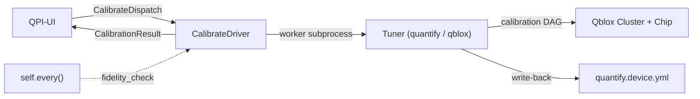
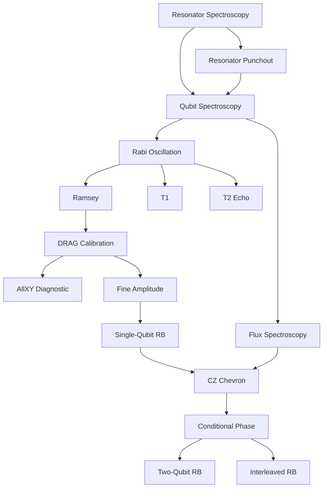

# RFC 0004 — Calibration Tuners

- **Status:** Draft
- **Author:** Martin Ahindura
- **Created:** 2026-07-30
- **Touches:** `qpi-driver` (Python), `qpi-ui` (Go/PocketBase), dashboard (React)

## 1. The idea

Superconducting transmon qubits suffer from continuous parameter drift (qubit
frequencies, pulse amplitudes, coherence times) on timescales of minutes to
hours due to TLS fluctuations, thermal variations, and magnetic flux noise.
Today, qpi can **store** calibration parameters in `quantify.device.yml` and
**execute circuits** through the `process` operation, but it has no mechanism to
**produce or maintain** those parameters. A lab operator must run calibration
experiments externally, manually update the YAML, and hope parameters haven't
drifted by the time jobs run.

This RFC adds a third operation — `calibrate` — and two devices,
`quantify_tuner` (using quantify-scheduler) and `qblox_tuner` (using
qblox-scheduler), that automate the full calibration lifecycle from initial
bring-up through continuous drift recalibration for superconducting transmon
chips with flux-tunable couplers on the Qblox hardware stack.

## 2. Vocabulary

| Term | Meaning |
| --- | --- |
| **Tuner** | The calibration backend, analogous to `Executor` for `process`. A `Tuner` runs calibration routines against a `QuantumDevice` and updates its parameters. |
| **Routine** | A single calibration experiment (e.g. Rabi, Ramsey, T1). Routines are nodes in a dependency DAG. |
| **Calibration DAG** | The directed acyclic graph of routine dependencies. A full calibration walks the DAG in topological order. |
| **Fidelity check** | A lightweight benchmarking pass (quick RB) used for periodic drift detection. |

## 3. Background & academic references

The calibration workflow for transmon qubits is well-established in the
literature and follows a structured dependency graph:

| # | Experiment | Depends on | Calibrates | Reference |
|---|-----------|------------|------------|-----------|
| 1 | Resonator Spectroscopy | — | Resonator frequency $f_r$ | [Koch et al., PRA 2007](https://arxiv.org/abs/cond-mat/0703002) |
| 2 | Resonator Punchout | 1 | Optimal readout power | [Qibocal docs](https://qibo.science/qibocal/stable/) |
| 3 | Qubit Spectroscopy (Two-Tone) | 1, 2 | Qubit frequency $f_{01}$ | [Schuster et al., Nature 2007](https://www.nature.com/articles/nature05461) |
| 4 | Rabi Oscillation | 3 | $\pi$-pulse amplitude (`amp180`) | [Vion et al., Science 2002](https://www.science.org/doi/10.1126/science.1069372) |
| 5 | Ramsey Interferometry | 4 | Fine $f_{01}$, $T_2^*$ | [Ramsey, Phys. Rev. 1950](https://journals.aps.org/pr/abstract/10.1103/PhysRev.78.695) |
| 6 | $T_1$ Measurement | 4 | Relaxation time $T_1$ | — |
| 7 | $T_2$ Echo (Hahn/CPMG) | 4 | Dephasing time $T_2$ | [Bylander et al., Nature Physics 2011](https://www.nature.com/articles/nphys1994) |
| 8 | DRAG Calibration | 5 | Motzoi parameter $\beta$ | [Motzoi et al., PRL 2009 (arXiv:0901.0534)](https://arxiv.org/abs/0901.0534) |
| 9 | AllXY Diagnostic | 8 | Validates 1Q gate params | [Reed, PhD thesis, Yale 2013](https://rsl.yale.edu/sites/default/files/files/RSL_Theses/reed.pdf) |
| 10 | Fine Amplitude Cal. | 8 | Sub-% amplitude correction | — |
| 11 | Single-Qubit RB | 10 | 1Q gate fidelity $F_{1Q}$ | [Magesan et al., PRL 2011](https://arxiv.org/abs/1109.6887) |
| 12 | Flux Spectroscopy | 3 | Coupler freq. vs. flux | — |
| 13 | CZ Chevron | 11, 12 | CZ amp/duration | [DiCarlo et al., Nature 2009](https://www.nature.com/articles/nature08121) |
| 14 | Conditional Phase | 13 | CZ $\phi_{\text{cond}} = \pi$ | [Sung et al., PRX 2021 (arXiv:2011.01261)](https://arxiv.org/abs/2011.01261) |
| 15 | Two-Qubit RB | 14 | 2Q gate fidelity $F_{2Q}$ | [Magesan et al., PRA 2012](https://arxiv.org/abs/1203.4550) |
| 16 | Interleaved RB (CZ) | 14 | CZ-specific fidelity | [Magesan et al., PRL 2012](https://arxiv.org/abs/1203.4550) |

Recent advances in automated calibration:

- **Millisecond-Scale Calibration** ([arXiv:2602.11912](https://arxiv.org/abs/2602.11912)): On-FPGA
  calibration loops achieving 74,000 recalibrations over 6 hours with >99.9%
  single-qubit fidelity.
- **CMA-ES Optimization** ([arXiv:2509.08555](https://arxiv.org/abs/2509.08555)): CMA-ES outperforms
  Nelder-Mead for high-dimensional pulse optimization.
- **End-to-End Framework** ([arXiv:2501.17825](https://arxiv.org/abs/2501.17825)): Theoretical framework
  linking hardware design to calibration optimization.
- **Qibocal** ([qibo.science](https://qibo.science/qibocal/stable/)): Open-source automated calibration
  with runcard-defined DAGs — the closest existing framework.

## 4. Decisions

| Decision | Resolution |
|----------|-----------|
| Device naming | `quantify_tuner` (quantify-scheduler) and `qblox_tuner` (qblox-scheduler) |
| Event type | New `CALIBRATION_RESULT` — structurally different from `JOB_RESULT` |
| YAML write-back | Driver-only (local). QPI-UI does not manage calibration files |
| Trigger model | Both: QPI-UI dispatches `CalibrateDispatch` + driver self-schedules periodic fidelity checks |
| v1 scope | Full DAG (steps 1–16), individually disableable |
| Package location | New `tuners/` at same level as `executors/`, mirroring its structure |
| pyproject.toml | Update existing `quantify` and `qblox` extras — no new extra |

## 5. How it works



1. **Dispatch** (QPI-UI or periodic timer): A `CalibrateDispatch` event reaches
   the driver with a mode (`full`, `partial`, `fidelity_check`) and optional
   target qubits/edges.
2. **Worker**: The driver drops the request onto a job queue. A subprocess
   running the `Tuner` picks it up.
3. **DAG walk**: The tuner builds a `CalibrationDAG` from the enabled routines,
   topologically sorts it, and runs each routine: build schedule → compile →
   acquire → fit → apply → persist.
4. **Report**: A `CalibrationResult` event is emitted back with per-qubit
   parameters, benchmarks, and status.
5. **Drift monitoring**: If `monitor_interval > 0`, the driver uses `self.every()`
   to run periodic lightweight RB checks. If fidelity drops below threshold, a
   partial recalibration is triggered automatically.

### The full calibration DAG



## 6. Implementation

The changes span both the Python driver (`qpi-driver/py`) and the Go server
(`qpi-ui`).

### 6.1 New operation & event types

Add `CALIBRATE = "calibrate"` to the `Operation` enum in
`qpi_driver/builtins/registry.py` and two new event types in
`qpi_driver/events.py`:

```python
CALIBRATE_DISPATCH = "CalibrateDispatch"
CALIBRATION_RESULT = "CalibrationResult"
```

### 6.2 Tuners package (`qpi_driver/tuners/`)

Mirrors the `executors/` structure:

```
qpi_driver/tuners/
├── __init__.py                    # Tuner base, resolve_tuner()
├── base/
│   ├── __init__.py                # Abstract Tuner class
│   ├── config.py                  # CalibrationConfig model (from calibration.yml)
│   ├── dag.py                     # CalibrationDAG — dependency graph + topological sort
│   ├── report.py                  # CalibrationReport, BenchmarkResult
│   └── routines.py                # CalibrationRoutine ABC + routine registry
├── quantify/                      # quantify_tuner device
│   ├── __init__.py                # QuantifyTuner
│   ├── config.py                  # Reuses/imports from executors/quantify/config.py
│   ├── elements/
│   │   └── __init__.py
│   └── routines/
│       ├── __init__.py            # ALL_ROUTINES registry
│       ├── resonator_spectroscopy.py
│       ├── resonator_punchout.py
│       ├── qubit_spectroscopy.py
│       ├── rabi.py
│       ├── ramsey.py
│       ├── t1.py
│       ├── t2_echo.py
│       ├── drag.py
│       ├── allxy.py
│       ├── fine_amplitude.py
│       ├── flux_spectroscopy.py
│       ├── cz_chevron.py
│       ├── conditional_phase.py
│       └── benchmarks/
│           ├── __init__.py
│           ├── rb.py              # Standard Clifford RB
│           ├── interleaved_rb.py  # Interleaved RB
│           └── allxy_check.py     # Quick AllXY fidelity smoke test
├── qblox/                         # qblox_tuner device (same structure)
│   ├── __init__.py                # QbloxTuner
│   ├── config.py
│   ├── elements/
│   │   └── __init__.py
│   └── routines/                  # Mirrors quantify/routines/
│       ├── __init__.py
│       ├── ...
│       └── benchmarks/
│           └── ...
├── fitting/                       # Shared fitting utilities (backend-agnostic)
│   ├── __init__.py
│   ├── lorentzian.py
│   ├── cosine.py
│   ├── exponential.py
│   └── chevron.py
└── utils/
    ├── __init__.py
    ├── persistence.py             # Atomic YAML write-back
    └── clifford.py                # Clifford group generation for RB
```

### 6.3 Tuner abstract base class

```python
class Tuner(ABC):
    """Abstract base for all calibration/tuning backends. Mirrors Executor."""

    def __init__(self, name: str, **kwargs): self.name = name

    @abstractmethod
    def calibrate(self, config: CalibrationConfig) -> CalibrationReport: ...

    @abstractmethod
    def check_fidelity(self, config: CalibrationConfig) -> dict[str, float]: ...

    @abstractmethod
    def recalibrate(self, qubits: list[str], config: CalibrationConfig) -> CalibrationReport: ...

    def close(self) -> None: ...
```

### 6.4 Calibration routine interface

```python
@dataclass
class CalibrationRoutine(ABC):
    """One node in the calibration DAG."""

    name: str
    depends_on: tuple[str, ...] = ()
    targets: Literal["qubits", "edges"] = "qubits"

    @abstractmethod
    def build_schedule(self, target, device, config) -> Schedule: ...

    @abstractmethod
    def analyse(self, dataset, target, device) -> dict[str, Any]: ...

    @abstractmethod
    def apply(self, device, target, params) -> None: ...
```

### 6.5 CalibrateDriver (`builtins/calibrate.py`)

Follows `QpuDriver`'s subprocess-isolation pattern:

```python
CALIBRATE_DEVICES = ("quantify_tuner", "qblox_tuner")

class CalibrateDriver(QpiDriver):
    """Calibrates transmon qubits via a tuner backend, emitting CalibrationResult events."""

    def __init__(self, *, tuner, calibration_config, monitor_interval=0,
                 fidelity_threshold=0.999, fidelity_2q_threshold=0.99, ...):
        ...
        if monitor_interval > 0:
            self.every(monitor_interval, self._check_fidelity)

    def handle_event(self, event):
        if event.type is EventType.CALIBRATE_DISPATCH:
            self._job_queue.put(event.payload)

    def _check_fidelity(self):
        """Periodic lightweight RB; triggers recalibration on drift."""
        self._job_queue.put({"mode": "fidelity_check"})
```

Key `-o` options:

| Option | Default | Description |
|--------|---------|-------------|
| `quantify_device_config` | `./quantify.device.yml` | Device calibration YAML |
| `quantify_hardware_config` | `./quantify.hardware.json` | Hardware connectivity config |
| `calibration_config` | `./calibration.yml` | Routines, sweep ranges, thresholds |
| `monitor_interval` | `0` (disabled) | Seconds between periodic RB fidelity checks |
| `fidelity_threshold` | `0.999` | 1Q gate fidelity recalibration trigger |
| `fidelity_2q_threshold` | `0.99` | 2Q gate fidelity threshold |
| `is_dummy` | `false` | Use dummy Qblox cluster |

### 6.6 Calibration config (`calibration.yml`)

```yaml
target_qubits: [q0, q1, q2]
target_edges: [q0_q1, q1_q2]

routines:
  resonator_spectroscopy:
    freq_range: [5.8e9, 6.5e9]
    freq_step: 0.5e6
    readout_power_dbm: -30
  rabi:
    amp_range: [0.0, 0.5]
    amp_step: 0.005
  ramsey:
    delay_range: [4e-9, 10e-6]
    n_points: 50
    artificial_detuning: 1e6
  # ... (all 16 routines configurable)

monitoring:
  rb_depths: [1, 10, 50]
  n_circuits_per_depth: 10
  shots: 512
  allxy_as_smoke_test: true
```

### 6.7 Benchmarking

Benchmarking routines sit at the leaves of the DAG. They produce fidelity
metrics but don't update device parameters.

**Randomized Benchmarking** (per [Magesan et al., PRL 2011](https://arxiv.org/abs/1109.6887)):
generate random Clifford sequences of depths $m$, append inverse Clifford, fit
survival probability $p(m) = A \cdot r^m + B$, compute fidelity
$F = 1 - \frac{(1-r)(d-1)}{d}$ where $d = 2$ for single-qubit.

**Interleaved RB** (per [Magesan et al., PRL 2012](https://arxiv.org/abs/1203.4550)):
interleave a target gate (e.g. CZ) between random Cliffords to isolate its
error rate.

### 6.8 Go server (`qpi-ui`)

#### Event types

Add `CalibrateDispatch` and `CalibrationResult` event type constants and
register a `handleCalibrationResult` handler following the `handleCryostatReading`
pattern — store calibration reports in a new `calibration_results` PocketBase
collection.

#### Calibrate dispatch endpoint

```
POST /api/op/calibrate/dispatch
{
    "driver_id": "...",
    "mode": "full",
    "target_qubits": ["q0"],
    "target_edges": ["q0_q1"]
}
```

Pushes a `CalibrateDispatch` event onto the driver's NNG PUSH socket, mirroring
the `JobDispatch` path.

#### `calibration_results` collection

| Field | Type | Description |
|-------|------|-------------|
| `driver` | text | Driver name that produced this result |
| `timestamp` | date | When calibration completed |
| `duration_s` | number | How long calibration took |
| `mode` | text | `"full"`, `"partial"`, or `"fidelity_check"` |
| `qubit_results` | json | Per-qubit calibrated parameters |
| `edge_results` | json | Per-edge calibrated parameters |
| `benchmarks` | json | Fidelity metrics |
| `status` | text | `"success"`, `"partial_failure"`, `"failed"` |

#### Driver catalog & operation

Add `Calibrate Operation = "calibrate"` to `internal/drivers/drivers.go` and
register `quantify_tuner` and `qblox_tuner` specs in the catalog.

#### Dashboard (v1 — minimal)

A calibration status panel showing: last calibration timestamp, per-qubit
fidelity metrics, calibration history list, and a "Trigger Calibration" button.
Full dashboard design (trend graphs, drift plots, DAG progress) is deferred.

### 6.9 Dependencies

Update existing `quantify` and `qblox` extras in `pyproject.toml` with
`scipy>=1.11` and `lmfit>=1.3`. Add alias extras `quantify_tuner` and
`qblox_tuner` pointing to the corresponding scheduler extras.

## 7. Testing strategy

### Tier 1: Fitting unit tests (no simulator)

Generate synthetic data with `numpy` using known analytic forms + Gaussian
noise, verify fits recover known parameters within tolerance. This is the bulk
of testing and validates the most error-prone component.

### Tier 2: Schedule compilation tests (dummy Cluster)

Use the dummy Cluster from `qblox-instruments` to verify each routine's
`build_schedule()` produces a valid, compilable `Schedule`. The dummy Cluster
returns all-zeros — this validates compilation, not analysis.

### Tier 3: Physics simulation (optional, scqubits)

Use [scqubits](https://scqubits.readthedocs.io/) (BSD-3) to generate
physically realistic synthetic acquisition data. Tests requiring it are marked
`@pytest.mark.scqubits` and skipped when not installed.

### Test files

| Test file | Tier | Tests |
|-----------|------|-------|
| `tests/test_calibration_dag.py` | 1 | DAG topological sort, cycle detection, partial DAG |
| `tests/test_calibration_config.py` | 1 | Config parsing, defaults, validation |
| `tests/test_fitting.py` | 1 | All fitting functions against synthetic data |
| `tests/test_tuner_routines.py` | 2 | Schedule compilation for each routine |
| `tests/test_calibrate_driver.py` | 1+2 | Driver event handling, worker lifecycle |
| `tests/test_persistence.py` | 1 | YAML write-back round-trip |
| `tests/test_clifford.py` | 1 | Clifford group generation + inverse correctness |

## 8. CLI usage

```bash
# Full calibration (quantify-scheduler)
qpi-driver start --operation calibrate --device quantify_tuner \
    -o quantify_device_config=./quantify.device.yml \
    -o quantify_hardware_config=./quantify.hardware.json \
    -o calibration_config=./calibration.yml \
    -o is_dummy=true

# Full calibration (qblox-scheduler)
qpi-driver start --operation calibrate --device qblox_tuner \
    -o quantify_device_config=./quantify.device.yml \
    -o quantify_hardware_config=./quantify.hardware.json \
    -o calibration_config=./calibration.yml

# With periodic drift monitoring (every 30 min)
qpi-driver start --operation calibrate --device quantify_tuner \
    -o monitor_interval=1800 \
    -o fidelity_threshold=0.999 \
    -o fidelity_2q_threshold=0.99
```

## 9. Verification plan

### Automated tests

```bash
make test-py-calibrate   # Fitting, DAG, config, routine compilation, driver lifecycle
make test-go             # Event routing, handler, collection schema
```

### Manual verification

- Deploy to a lab node with a Qblox Cluster + transmon chip
- Run full calibration DAG and verify parameter convergence
- Compare RB fidelities before and after calibration
- Run periodic monitoring overnight — verify drift detection triggers recalibration
- Verify `quantify.device.yml` is correctly updated after calibration
- Verify `process` driver picks up updated parameters for subsequent jobs
