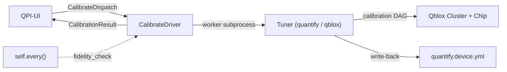
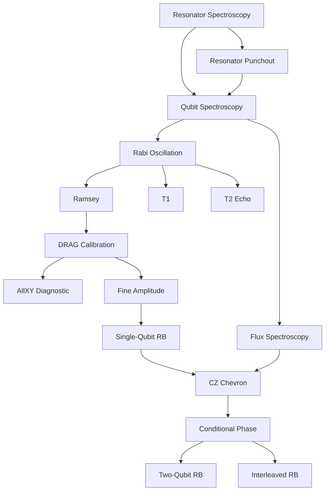

# RFC 0004 — Calibration Tuners

- **Status:** Implemented — except §9's manual verification, which needs a chip.
  RFC 0005 completes the graph this one framed.
- **Author:** Martin Ahindura
- **Created:** 2026-07-30
- **Depends on:** RFC 0001 (driver framework, events), RFC 0003 (operations and devices)
- **Touches:** `qpi-driver` (Python **and**, for the operation enum, Go and
  TypeScript), `qpi-ui` (Go/PocketBase), dashboard (React)

## 1. The idea

Superconducting transmon qubits suffer from continuous parameter drift (qubit
frequencies, pulse amplitudes, coherence times) on timescales of minutes to
hours due to TLS fluctuations, thermal variations, and magnetic flux noise.
Today, qpi can **store** calibration parameters in `quantify.device.yml` and
**execute circuits** through the `process` operation, but it has no mechanism to
**produce or maintain** those parameters. A lab operator must run calibration
experiments externally, manually update the YAML, and hope parameters haven't
drifted by the time jobs run.

This RFC adds a third operation — `calibrate` — and two devices,
`quantify_tuner` (using quantify-scheduler) and `qblox_tuner` (using
qblox-scheduler), that automate the full calibration lifecycle from initial
bring-up through continuous drift recalibration for superconducting transmon
chips with flux-tunable couplers on the Qblox hardware stack.

## 2. Vocabulary

| Term | Meaning |
| --- | --- |
| **Tuner** | The calibration backend, analogous to `Executor` for `process`. A `Tuner` runs calibration routines against a `QuantumDevice` and updates its parameters. |
| **Routine** | A single calibration experiment (e.g. Rabi, Ramsey, T1). Routines are nodes in a dependency DAG. |
| **Calibration DAG** | The directed acyclic graph of routine dependencies. A full calibration walks the DAG in topological order. |
| **Fidelity check** | A lightweight benchmarking pass (quick RB) used for periodic drift detection. |

## 3. Background & academic references

The calibration workflow for transmon qubits is well-established in the
literature and follows a structured dependency graph:

| # | Experiment | Depends on | Calibrates | Reference |
|---|-----------|------------|------------|-----------|
| 1 | Resonator Spectroscopy | — | Resonator frequency $f_r$ | [Koch et al., PRA 2007](https://arxiv.org/abs/cond-mat/0703002) |
| 2 | Resonator Punchout | 1 | Optimal readout power | [Qibocal docs](https://qibo.science/qibocal/stable/) |
| 3 | Qubit Spectroscopy (Two-Tone) | 1, 2 | Qubit frequency $f_{01}$ | [Schuster et al., Nature 2007](https://www.nature.com/articles/nature05461) |
| 4 | Rabi Oscillation | 3 | $\pi$-pulse amplitude (`amp180`) | [Vion et al., Science 2002](https://www.science.org/doi/10.1126/science.1069372) |
| 5 | Ramsey Interferometry | 4 | Fine $f_{01}$, $T_2^*$ | [Ramsey, Phys. Rev. 1950](https://journals.aps.org/pr/abstract/10.1103/PhysRev.78.695) |
| 6 | $T_1$ Measurement | 4 | Relaxation time $T_1$ | — |
| 7 | $T_2$ Echo (Hahn/CPMG) | 4 | Dephasing time $T_2$ | [Bylander et al., Nature Physics 2011](https://www.nature.com/articles/nphys1994) |
| 8 | DRAG Calibration | 5 | Motzoi parameter $\beta$ | [Motzoi et al., PRL 2009 (arXiv:0901.0534)](https://arxiv.org/abs/0901.0534) |
| 9 | AllXY Diagnostic | 8 | Validates 1Q gate params | [Reed, PhD thesis, Yale 2013](https://rsl.yale.edu/sites/default/files/files/RSL_Theses/reed.pdf) |
| 10 | Fine Amplitude Cal. | 8 | Sub-% amplitude correction | — |
| 11 | Single-Qubit RB | 10 | 1Q gate fidelity $F_{1Q}$ | [Magesan et al., PRL 2011 (arXiv:1009.3639)](https://arxiv.org/abs/1009.3639) |
| 12 | Flux Spectroscopy | 3 | Coupler freq. vs. flux | — |
| 13 | CZ Chevron | 11, 12 | CZ amp/duration | [DiCarlo et al., Nature 2009](https://www.nature.com/articles/nature08121) |
| 14 | Conditional Phase | 13 | CZ $\phi_{\text{cond}} = \pi$ | [Sung et al., PRX 2021 (arXiv:2011.01261)](https://arxiv.org/abs/2011.01261) |
| 15 | Two-Qubit RB | 14 | 2Q gate fidelity $F_{2Q}$ | [Magesan et al., PRA 2012 (arXiv:1109.6887)](https://arxiv.org/abs/1109.6887) |
| 16 | Interleaved RB (CZ) | 14 | CZ-specific fidelity | [Magesan et al., PRL 2012 (arXiv:1203.4550)](https://arxiv.org/abs/1203.4550) |

The three RB citations are deliberately distinct and easy to conflate: 1009.3639
is the scalable-and-robust RB protocol (PRL 106, 180504), 1109.6887 is the
general multi-qubit characterisation framework the fidelity formula comes from
(PRA 85, 042311), and 1203.4550 is interleaved RB (PRL 109, 080505).

Recent advances in automated calibration:

- **Millisecond-Scale Calibration and Benchmarking of Superconducting Qubits**
  ([arXiv:2602.11912](https://arxiv.org/abs/2602.11912)): a closed-loop on-FPGA
  recalibration protocol, reporting more than 74,000 consecutive recalibrations over
  6 hours of continuous operation. *(Preprint. Nothing in the design below depends on
  it; it is cited as motivation only.)*
- **CMA-ES Optimization** ([arXiv:2509.08555](https://arxiv.org/abs/2509.08555)): CMA-ES outperforms
  Nelder-Mead for high-dimensional pulse optimization.
- **End-to-End Framework** ([arXiv:2501.17825](https://arxiv.org/abs/2501.17825)): Theoretical framework
  linking hardware design to calibration optimization.
- **Qibocal** ([qibo.science](https://qibo.science/qibocal/stable/)): Open-source automated calibration
  with runcard-defined DAGs — the closest existing framework.

## 4. Decisions

Recorded here rather than in a separate ADR, per the RFC conventions.

| Decision | Resolution |
|----------|-----------|
| Device naming | `quantify_tuner` (quantify-scheduler) and `qblox_tuner` (qblox-scheduler) |
| Event type | New `CALIBRATION_RESULT` — structurally different from `JOB_RESULT` |
| YAML write-back | Driver-only (local). QPI-UI does not manage calibration files |
| Trigger model | Both: QPI-UI dispatches `CalibrateDispatch` + driver self-schedules periodic fidelity checks |
| v1 scope | Full DAG (steps 1–16), individually disableable |
| Package location | New `tuners/` at same level as `executors/`, mirroring its structure |
| Dispatch transport | A `calibration_requests` collection the existing driver dispatcher polls — **not** a direct socket write from an HTTP handler. §6.8 |
| Result persistence | A `calibration_results` collection. This reverses an earlier decision here in favour of the events log; §6.8 records why. |
| pyproject.toml | Alias extras `quantify_tuner`/`qblox_tuner` pointing at the scheduler extras, following the existing `qiskit_aer = ["qpi-driver[aer]"]` precedent; the fitting dependencies go into the `quantify` and `qblox` extras themselves. §6.9 |

### Why a new operation rather than a new device

`calibrate` is a third value in an enum RFC 0003 §13.1 calls closed on purpose:
every value needs a server-side handler, so growing it is a coordinated change
across three SDKs and QPI-UI (§6.1 lists the whole blast radius). That cost is
worth paying only because the two alternatives are worse:

- **A `process` device.** The contract of `process` is "a job is pushed to you,
  you emit a `JobResult`", and a job is a user-submitted circuit that bills
  against that user's QPU seconds. A calibration run bills nobody, produces no
  counts, and takes hours. It would have to be smuggled through `quantum_jobs`
  with a sentinel payload, and every consumer of the jobs collection — the
  scheduler, the billing deduction in `handleDriverJobResult`, the dashboard's
  job list — would need to learn to skip it.
- **A `monitor` device.** A monitor never handles an inbound event
  (`BlueforsGen1Driver.handle_event` logs and drops everything). Calibration is
  triggered as well as scheduled, so it needs the inbound half.

The distinguishing property is genuinely the *contract*, not the backend, which
is exactly what RFC 0003 says an operation is.

**Rejected.** *Writing calibration parameters back through QPI-UI*: the device
YAML is read by the `process` driver on the same node, so a round trip through
the server would add a network partition between a file's two local users for no
gain. *Deriving the DAG from the routines' `depends_on` alone at import time*: it
is derived from them, but the enabled set comes from `calibration.yml`, so the
graph is built per run rather than once per process. *One set of routines per
scheduler*: the two expose the same gate vocabulary, so the duplication buys
nothing and costs a second copy to keep in step — §6.2 records what to do with
the differences that are real.

## 5. How it works



1. **Dispatch** (QPI-UI or periodic timer): A `CalibrateDispatch` event reaches
   the driver with a mode (`full`, `partial`, `fidelity_check`) and optional
   target qubits/edges.
2. **Worker**: The driver drops the request onto a job queue. A subprocess
   running the `Tuner` picks it up.
3. **DAG walk**: The tuner builds a `CalibrationDAG` from the enabled routines,
   topologically sorts it, and runs each routine: build schedule → compile →
   acquire → fit → apply → persist.
4. **Report**: A `CalibrationResult` event is emitted back with per-qubit
   parameters, benchmarks, and status.
5. **Drift monitoring**: If `drift_check_interval > 0`, the driver uses `self.every()`
   to run periodic lightweight RB checks. If fidelity drops below threshold, a
   partial recalibration is triggered automatically.

### The full calibration DAG



## 6. Implementation

The changes span both the Python driver (`qpi-driver/py`) and the Go server
(`qpi-ui`).

### 6.1 New operation & event types

An operation is closed across *all three* SDKs and the server (RFC 0003 §8,
§13.1), and the event-type list is closed in the same way. Adding `calibrate`
is therefore not a Python-only change; every row below is required for the
build to stay green, and several are guarded by tests that assert the current
sets are exactly what they are.

| Where | Change | Note |
|-------|--------|------|
| `qpi-driver/py/qpi_driver/builtins/registry.py` | `CALIBRATE = "calibrate"` on `Operation` | `_DEVICES` is built per operation, so this alone opens the registry slot |
| `qpi-driver/py/qpi_driver/events.py` | `CALIBRATE_DISPATCH`, `CALIBRATION_RESULT` on `EventType` | |
| `qpi-driver/go/devices` | `Calibrate` const, `Operations()`/`OperationNames()` | `TestOperationsAreAClosedSet` in `devices_test.go` asserted a *pair*; it becomes a triple, and was renamed for it |
| `qpi-driver/go/events.go` | `CalibrateDispatch`, `CalibrationResult` | |
| `qpi-driver/js/src/devices.ts` | `Operation.Calibrate` and the `allOperations` array | same closed-set assertion as Go |
| `qpi-driver/js/src/events.ts` | the two event types | |
| `qpi-ui/internal/drivers/drivers.go` | `Calibrate Operation = "calibrate"`, `QuantifyTuner`/`QbloxTuner` `Kind` consts | |
| `qpi-ui/internal/drivers/catalog.go` | `eventCalibrateDispatch`/`eventCalibrationResult`, a `calibrateOptions()` helper mirroring `processOptions()`, and the two specs | `Languages: []Language{Python}` — no other SDK ships a tuner |
| `qpi-ui/internal/api/schema.go` | both types in the `EventType` consts **and in `AllEventTypes`** | driver registration validates a driver's chosen events against this list, and `drivers_test.go` asserts every catalog event name has a handler |
| `qpi-ui/internal/api/nng_driver.go` | `registry.Register(EventCalibrationResult, handleCalibrationResult)` | |
| `README.md`, `docs/driver/operations.md` | the two-operation prose | both currently enumerate `process` and `monitor` as the whole set |

Neither the Go nor the TypeScript SDK ships a tuner device — as with `process`,
they gain the operation name and must say plainly that they ship no devices for
it (RFC 0003 §8) rather than report an empty list.

### 6.2 Tuners package (`qpi_driver/tuners/`)

Mirrors the `executors/` structure, with one deliberate difference: **there is
one set of routines, not one per scheduler.**

quantify-scheduler and qblox-scheduler expose the same gate vocabulary — `Rxy`,
`X`, `Reset`, `Measure`, `CZ`, `IdlePulse`, `SquarePulse`, `SetClockFrequency` —
under two import paths. A routine composed against that vocabulary is therefore
backend-agnostic already, and a per-backend copy would be sixteen more files to
keep in step for no gain. Two seams carry everything that genuinely differs:

- **`base/backend.py`** — a `SchedulerBackend` binds one scheduler's operation
  classes and knows how to turn a finished schedule into a dataset. quantify
  compiles and drives an instrument coordinator; qblox hands the schedule to a
  `HardwareAgent`. That is the whole of the difference in execution.
- **`base/device.py`** — the device models are not the same shape. quantify
  builds on qcodes, where a parameter is callable (`element.rxy.amp180()`);
  qblox uses pydantic, where it is a plain attribute. They also disagree on
  names: the DRAG coefficient is `motzoi` in one and `beta` in the other. A
  routine names the concept and this module finds whichever the device has.

```
qpi_driver/tuners/
├── __init__.py                    # Tuner, resolve_tuner()
├── base/
│   ├── __init__.py                # Tuner ABC — the DAG walk and write-back live here
│   ├── backend.py                 # SchedulerBackend: the operations a routine composes
│   ├── config.py                  # CalibrationConfig (from calibration.yml)
│   ├── dag.py                     # CalibrationDAG — graph, topological sort, the walk
│   ├── device.py                  # Reading/writing device parameters across both models
│   ├── report.py                  # CalibrationReport, RoutineResult, BenchmarkResult
│   └── routines.py                # CalibrationRoutine ABC
├── routines/                      # ONE set, shared by every tuner
│   ├── __init__.py                # ROUTINE_CLASSES, all_routines(), routine_names()
│   ├── spectroscopy.py            # resonator, punchout, qubit, flux
│   ├── single_qubit.py            # rabi, ramsey, t1, t2_echo, drag, allxy, fine_amplitude
│   ├── two_qubit.py               # cz_chevron, conditional_phase
│   └── benchmarks.py              # rb, interleaved_rb, allxy_check
├── quantify/__init__.py           # QuantifyTuner + QuantifyBackend
├── qblox/__init__.py              # QbloxTuner + QbloxBackend
├── fitting/                       # Backend-agnostic curve fits
│   ├── __init__.py
│   ├── core.py                    # FitError, range guards, dataset access
│   ├── lorentzian.py              # spectroscopy, punchout
│   ├── cosine.py                  # rabi, ramsey, drag, fine amplitude
│   ├── exponential.py             # t1, t2, RB decay
│   └── chevron.py                 # CZ chevron, conditional phase
└── utils/
    ├── __init__.py
    ├── persistence.py             # Verified, atomic YAML write-back (§10)
    └── clifford.py                # The single-qubit Clifford group, for RB
```

A tuner therefore supplies a backend and a device, and inherits the DAG walk,
the routines, the fitting and the write-back. Adding a third scheduler is a
`SchedulerBackend` and a `Tuner`; it is not sixteen more experiments.

### 6.3 Tuner abstract base class

```python
class Tuner(ABC):
    """Runs calibration routines against a quantum device and updates it."""

    def __init__(self, name: str, **kwargs): ...

    @property
    @abstractmethod
    def backend(self) -> SchedulerBackend: ...

    @property
    @abstractmethod
    def device(self) -> Any: ...

    def calibrate(self, config: CalibrationConfig) -> CalibrationReport: ...
    def recalibrate(self, qubits: list[str], config: CalibrationConfig) -> CalibrationReport: ...
    def check_fidelity(self, config: CalibrationConfig) -> CalibrationReport: ...
    def close(self) -> None: ...
```

The three entry points are the same DAG walk over different subsets — the whole
enabled graph, a partial run, the benchmarks alone — so they are implemented once
on the base class rather than per tuner.

`recalibrate` narrows twice, and both narrowings are what make it worth having
over a full run. The **targets** narrow to the given qubits plus any edge
touching one of them. The **routines** narrow to `RECALIBRATION_ROOTS`
(`qubit_spectroscopy`) and everything downstream of it: downstream because
re-finding a frequency invalidates the gates tuned against it, and rooted there
because the readout chain is a bring-up step rather than a drift one and is most
of the cost of a full calibration. A drift the qubit routines cannot fix
therefore needs a full run, which is an operator's decision rather than the
drift check's.

`check_fidelity` returns a `CalibrationReport` rather than a bare
`dict[str, float]` so that every mode emits the same payload shape;
`CalibrationReport.fidelities()` is what reduces it to the per-target numbers a
threshold is compared against, taking the worst protocol per target because a
drift check should fire on the worst evidence it has.

### 6.4 Calibration routine interface

```python
class CalibrationRoutine(ABC):
    """One node in the calibration DAG."""

    name: str
    depends_on: tuple[str, ...] = ()
    targets: Literal["qubits", "edges"] = "qubits"
    updates: tuple[str, ...] = ()      # device parameters written
    benchmark: bool = False            # whether its result is a gate fidelity

    @abstractmethod
    def build_schedule(self, target, device, config, backend) -> Schedule: ...

    @abstractmethod
    def analyse(self, dataset, target, device, config) -> dict[str, Any]: ...

    def apply(self, device, target, params) -> None: ...
```

`benchmark` is declared rather than inferred from an empty `updates`: T1 writes
no device parameter either, and recording it as a benchmark would put a `None`
fidelity in front of the drift check.

`analyse` **raises** rather than returning zeros when it cannot fit. This is the
difference between a calibration that fails and one that quietly writes
`t1 = 0.0` to the device as though it had measured it.

### 6.5 CalibrateDriver (`builtins/calibrate.py`)

Follows `QpuDriver`'s subprocess-isolation pattern:

```python
CALIBRATE_DEVICES = ("quantify_tuner", "qblox_tuner")

class CalibrateDriver(QpiDriver):
    """Calibrates transmon qubits via a tuner backend, emitting CalibrationResult events."""

    def __init__(self, *, tuner, calibration_config, drift_check_interval=0,
                 fidelity_threshold=0.999, fidelity_2q_threshold=0.99, ...):
        ...
        if drift_check_interval > 0:
            self.every(drift_check_interval, self._check_fidelity)

    def handle_event(self, event):
        if event.type is EventType.CALIBRATE_DISPATCH:
            self._job_queue.put(event.payload)
        else:
            log.warning(
                "dropping event %s: calibrate driver does not handle %s",
                event.id,
                event.type.value,
            )

    def _check_fidelity(self):
        """Periodic lightweight RB; triggers recalibration on drift."""
        self._job_queue.put({"mode": "fidelity_check"})
```

Registering the timer in `__init__` is safe even though `_job_queue` is created
in `_on_start`: `QpiDriver.run` calls `_on_start()` before `_start_periodic()`,
which is the same order `BlueforsGen1Driver` relies on.

Unlike a QPU's worker, this one is long-running per item — a full DAG walk is
hours, not seconds. Two consequences the implementation has to face rather than
inherit: `_on_stop`'s two-second join before `terminate()` will always time out
mid-calibration, so the poison pill needs a cooperative cancellation check
between routines if a clean stop is to mean anything; and a routine that hangs
on an instrument has no `job_timeout` equivalent, so the per-routine timeout
belongs in `calibration.yml` (§6.6).

Key `-o` options:

| Option | Default | Description |
|--------|---------|-------------|
| `quantify_device_config` | `./quantify.device.yml` | Device calibration YAML |
| `quantify_hardware_config` | `./quantify.hardware.json` | Hardware connectivity config |
| `calibration_config` | `./calibration.yml` | Routines, sweep ranges, thresholds |
| `drift_check_interval` | `0` (disabled) | Seconds between periodic RB fidelity checks |
| `fidelity_threshold` | `0.999` | 1Q gate fidelity recalibration trigger |
| `fidelity_2q_threshold` | `0.99` | 2Q gate fidelity threshold |
| `is_dummy` | `false` | Use dummy Qblox cluster |

Named `drift_check_interval` rather than `monitor_interval` because `monitor` is
already an operation, and an option on a `calibrate` device that appears to name
a different operation is the kind of collision this vocabulary is careful about
(§2, RFC 0003 §2). The three `-o` keys shared with `process` — the two quantify
paths and `is_dummy` — keep their existing names and defaults deliberately: a
tuner and the QPU beside it read the same two files, and an operator who had to
spell the same path two different ways would eventually spell it two different
values.

All of them have working defaults, so — as with `process` — a tuner starts with
no `-o` at all, and a missing `calibration.yml` is the error that surfaces
first. Reading an option is what declares it (RFC 0003 §13.6), so the catalog's
`calibrateOptions()` must list exactly the keys `build_from_options` reads: an
option nothing reads is rejected at startup, so a key in the catalog and not in
the builder turns a generated snippet into a driver that refuses to launch.

### 6.6 Calibration config (`calibration.yml`)

```yaml
target_qubits: [q0, q1, q2]
target_edges: [q0_q1, q1_q2]

# Per-routine wall-clock ceiling. The `process` operation's job_timeout has no
# equivalent here — a routine that hangs on an instrument would otherwise hang
# the worker for the life of the driver.
routine_timeout_s: 900

routines:
  resonator_spectroscopy:
    freq_range: [5.8e9, 6.5e9]
    freq_step: 0.5e6
    readout_power_dbm: -30
  rabi:
    amp_range: [0.0, 0.5]
    amp_step: 0.005
  ramsey:
    delay_range: [4e-9, 10e-6]
    n_points: 50
    artificial_detuning: 1e6
  # ... (all 16 routines configurable)

monitoring:
  rb_depths: [1, 10, 50]
  n_circuits_per_depth: 10
  shots: 512
  allxy_as_smoke_test: true
```

### 6.7 Benchmarking

Benchmarking routines sit at the leaves of the DAG. They produce fidelity
metrics but don't update device parameters.

**Randomized Benchmarking** (protocol per [Magesan et al., PRL 2011](https://arxiv.org/abs/1009.3639),
fidelity formula per [Magesan et al., PRA 2012](https://arxiv.org/abs/1109.6887)):
generate random Clifford sequences of depths $m$, append inverse Clifford, fit
survival probability $p(m) = A \cdot r^m + B$, compute fidelity
$F = 1 - \frac{(1-r)(d-1)}{d}$ where $d = 2^n$ — so $d = 2$ for single-qubit and
$d = 4$ for two-qubit.

**Interleaved RB** (per [Magesan et al., PRL 2012](https://arxiv.org/abs/1203.4550)):
interleave a target gate (e.g. CZ) between random Cliffords to isolate its
error rate.

### 6.8 Go server (`qpi-ui`)

The event-type constants and catalog entries are listed in §6.1. What follows is
the mechanism, which is where this operation differs from the two that exist.

#### Dispatching a calibration

**A driver's PUSH socket is not reachable from an HTTP handler.** It is a local
variable inside `runDriverDispatcher`, one goroutine per connected driver, and
the only thing that goroutine sends is whatever `scheduler.FetchNextJob` hands
it. `activeDrivers` holds a `context.CancelFunc` per driver and nothing else —
there is no registry of sockets or channels to write to. So "push a
`CalibrateDispatch` onto the driver's socket" from a route handler is not a
small addition; it is a new outbound path.

Two ways to build it:

1. **A queue collection the dispatcher polls** — the recommended one. A
   `calibration_requests` collection with `driver`, `mode`, `target_qubits`,
   `target_edges` and `status`, plus a `FetchNextCalibration(app, driverID)`
   mirroring `FetchNextJob`. `runDriverDispatcher` selects between the two
   sources and wraps whichever it gets in the matching event. This inherits, for
   free, everything the job path already solved: the request survives a server
   restart, a failed `sock.Send` can flip it back to `pending` exactly as a job
   is requeued, and a calibration requested while the driver is offline runs when
   it reconnects instead of being dropped on the floor. Given a calibration is
   the *slowest* thing in the system, losing one silently is the worst failure
   mode available.
2. **An in-memory channel per driver**, registered beside `activeDrivers` and
   selected on in the dispatcher loop. Less code, but a request is lost on
   restart, on a send error, and whenever the driver is not currently attached —
   and it introduces a second, differently-shaped outbound mechanism.

This RFC takes (1). The HTTP surface stays as sketched but is a plain create
against the queue, not a socket write:

```
POST /api/op/calibrate/dispatch    (admin-only — see §10)
{
    "driver_id": "...",
    "mode": "full",
    "target_qubits": ["q0"],
    "target_edges": ["q0_q1"]
}
```

One calibration at a time, and the unit is **the chip, not the driver**. A second
run delivered to a busy tuner would only queue inside the driver, where the server
can no longer see it; and nothing stops two tuners being registered against one
QPU, each with its own dispatcher, so a per-driver wait would let both sweep the
same qubits and both write the device YAML — atomic per write (§10) and a mix of
two runs afterwards. `FetchNextCalibration` therefore withholds a request while
any request is `running` on that driver's QPU, which it reads by traversing the
relation (`driver.qpu`) rather than denormalising it onto the request.

Two `full` runs back to back are an ordinary thing to ask for, though: the
endpoint takes both as `pending` and the second goes out when the first reports.
The dispatch carries the request ID and the report echoes it back, so which report
answers which request never depended on there being one in flight.

Serializing the queue is not the whole answer, because a tuner also calibrates on
its own clock: `drift_check_interval` puts a `fidelity_check` on the tuner's
internal queue without asking the server, guarded by a `threading.Event` that
means nothing to a second process. Two things close that. A second tuner is
refused at `/api/op/drivers/connect` while one of the same operation is connected
to that QPU (§10) — registering one is still allowed, for a standby or a
replacement prepared before the running one is retired. And the `QPUState` event
(RFC 0001 §4) tells a tuner when its QPU is under maintenance, which is when it
stops scheduling its own checks while still honouring a dispatched calibration.

#### Receiving a result

`handleCalibrationResult` validates the payload — as `handleCryostatReading`
rejects a reading with no readings, this rejects a report with no mode or status
— and stores it in a `calibration_results` collection, attributed to both the
driver that sent it and the QPU that driver belongs to.

**Why a collection rather than the events log.** An earlier version of this RFC
deferred it: `CryostatReading` appends to the shared `events` trace log and
creates no per-type collection, and a new collection costs a model, a migration,
a config key and access rules. Two things settled it the other way. The dashboard
panel below is a *history list* and a *fidelity trend*, which is a query over
months of reports rather than a tail of recent events — exactly the case the
deferral named as the trigger for promoting it. And retention is different in
kind: a calibration report is far larger and far rarer than a cryostat reading,
so the events log's prune policy, tuned for a monitor emitting every few seconds,
would discard the reports on entirely the wrong schedule. Sharing the log would
have meant a second retention rule inside it, which is most of a collection
without the query.

The full cost is therefore paid, and is: a `CalibrationResult` model in
`internal/db/models.go` with the struct tags the migrator reads, a collection in
`internal/db/migrate.go`, `DefaultCalibrationResultsCollection` plus its flag and
its `GetCollectionName` case in `internal/config/config.go`, and
authenticated-read/superuser-CUD access rules.

| Field | Type | Description |
|-------|------|-------------|
| `driver` | relation | Driver that produced this result |
| `qpu` | relation | QPU that driver belongs to |
| `timestamp` | date | When the calibration completed |
| `duration_s` | number | How long it took |
| `mode` | text | `"full"`, `"partial"`, or `"fidelity_check"` |
| `backend` | text | Which scheduler ran it |
| `routine_results` | json | Per-routine, per-target fitted parameters |
| `benchmarks` | json | Fidelity metrics |
| `errors` | json | What failed, per routine and target |
| `status` | text | `"success"`, `"partial_failure"`, `"failed"` |

The payload's fields are **flat**, beside `job_id` — the handler unmarshals the
event payload straight into `CalibrationResultPayload`. Nested under a `results`
key it parses without error and leaves every field at its zero value, saving a
blank row for a calibration that really ran; a test asserts the shape in both
languages.

A report also closes out the queued request it answers, which is what lets the
dispatcher offer the next one for that given driver.

#### Dashboard (v1 — minimal)

An admin-only Calibration tab reading `calibration_results` for what the chip
looks like and `calibration_requests` for whether something is running. The two
are separate for a reason: a calibration takes hours, and the queued request is
the only thing that can say "in progress" during the gap before a report exists.

It shows measured fidelity per target, the current parameters, and the run
history, and it queues a calibration through the endpoint above. Three details
are load-bearing rather than cosmetic:

- **Each target is judged against the threshold that governs it** — the
  two-qubit one for an edge, the one-qubit one for a qubit. A CZ an order of
  magnitude worse than a single-qubit gate is normal; holding it to the 1Q
  threshold would make the panel cry wolf and train operators to ignore it.
- **Parameters are grouped by qubit, not by routine.** "What does q0 look like
  now" is the question an operator has; a routine spans every target while a
  target spans only a handful of routines.
- **The trigger modal defaults to the drift check**, not the full run. It is the
  common case, it is cheap, and it changes nothing — whereas a mis-clicked full
  calibration costs hours of QPU time.

Trend graphs, drift plots and live DAG progress are still deferred.

One incidental thing settled while there: the `QPU` interface carried a
`calibration_data?: unknown` field that no collection on the server has —
vestigial, and removed rather than quietly repurposed as this feature's hook.

### 6.9 Dependencies

The tuners add no dependency, so the `quantify` and `qblox` extras carry their
scheduler and instruments only. The fitting is three `scipy.optimize.curve_fit`
calls and `scipy` is a core dependency already; `lmfit` is imported nowhere here,
and could not be dropped from an install even if it were — `quantify-core` is in
both schedulers' dependency chains and requires it. Nothing about the extras can
make either install smaller.

The `*_tuner` extras are therefore plain aliases —
`quantify_tuner = ["qpi-driver[quantify]"]` and
`qblox_tuner = ["qpi-driver[qblox]"]`, following the existing
`qiskit_aer = ["qpi-driver[aer]"]` precedent, so the extra an operator installs
matches the `--device` they were given. `Spec.Extra` in the catalog names these,
which is what the generated setup snippet pastes.

## 7. Testing strategy

### Tier 1: Fitting unit tests (no simulator)

Generate synthetic data with `numpy` using known analytic forms + Gaussian
noise, verify fits recover known parameters within tolerance. This is the bulk
of testing and validates the most error-prone component.

### Tier 2: Schedule compilation tests (dummy Cluster)

Use the dummy Cluster from `qblox-instruments` to verify each routine's
`build_schedule()` produces a valid, compilable `Schedule`. The dummy Cluster
returns all-zeros — this validates compilation, not analysis.

### Tier 3: Physics simulation (scqubits + qutip)

Tiers 1 and 2 leave a gap that matters. Tier 1 generates its data from the same
analytic form the fit assumes — a decaying cosine in, a decaying cosine fitted —
so it proves the optimiser converges but not that the model is the right one.
Tier 2 proves a schedule compiles, and the dummy cluster returns no data at all.

Tier 3 closes it. [scqubits](https://scqubits.readthedocs.io/) (BSD-3)
diagonalises a real Cooper-pair-box Hamiltonian for the transmon's levels, and
`qutip` integrates the Lindblad master equation for the time-domain responses.
Nothing is generated from a fitting model, so a routine that recovers the
simulator's parameters has been tested against physics rather than against
itself. Tests are marked `@pytest.mark.scqubits`, live in the `sim` dependency
group, and skip when it is absent.

**Both schedulers, not one.** Everything in this tier runs under
quantify-scheduler and qblox-scheduler, parametrised rather than duplicated —
`test_calibration_loop` proves each of its claims twice. That is not symmetry for
its own sake: quantify-scheduler is being deprecated, and the qblox path having
been a stub is how a tuner that could never complete a write-back went
unnoticed. A claim proved for one scheduler and untested for the other is the
shape this gap took, so the tests are arranged to make it impossible.

**Two qubits, and where the argument above weakens.** A CZ needs a joint state —
two independent density matrices cannot be entangled, so a Bell state could not
come out wrong because it could not come out at all. `simulation/coupled.py`
holds both transmons in one 9-dimensional register and couples them, and the
gate falls out of walking the control through the `|11⟩`–`|02⟩` avoided
crossing: conditional phase 179.3°, Bell concurrence above 0.98, leakage under
0.5%, none of it written down.

But two of its numbers are *chosen* rather than derived — the exchange coupling
`G_MHZ` and the flux-to-detuning curve `FLUX_CURVATURE_GHZ` — because they
describe a coupler and a flux line this project has no device to measure. Given
them the dynamics are real, and a routine still has to find a crossing it was
not told the location of. The sentence above about nothing being generated from
a fitting model is a claim about the one-qubit tier; it is weaker here. Read a
two-qubit result as "the routine recovers the operating point of a plausible
coupler", not "of a real one". That is a smaller claim than the one-qubit tier
makes, and larger than the nothing that preceded it.

**The readout chain, and the same weakening again.** Two routines have the readout
itself as their subject, and against two fixed points in the IQ plane both swept a
flat line — which is why they were the last to be simulated.
`simulation/resonator.py` gives each qubit a resonance with a linewidth to find
and a power at which the resonance walks from dressed to bare, so
`resonator_spectroscopy` fits a real Lorentzian (recovering the modelled `kappa`,
1.96 MHz against 2.00) and `resonator_punchout` measures a shift bounded by one
dispersive shift. Reading out away from the resonance costs contrast, which is what
makes a wrong `clock_freqs.readout` degrade every routine after it rather than only
the one that found it.

What is *not* modelled is the two qubit states pulling the resonance to two
different frequencies. The lineshape follows the ground state and the
discrimination stays in the blob geometry the coordinator already had, so the best
point to read out at here is the resonance itself — where a real chip has an
optimum *between* the two pulled peaks, and reaching it is a calibration this
simulator cannot pose. Read a readout result as "the routine measures the
resonator's lineshape and its power dependence", which is what these two routines
do, and not as a model of dispersive readout.

**Pulse envelopes, because a derivative cannot survive averaging.** A `Rxy`
compiles to a DRAG pulse: a Gaussian with a scaled derivative of itself on the
other quadrature, and that derivative is what cancels the phase error a fast pulse
picks up from the `|1⟩`–`|2⟩` transition. A model that averaged the pulse to a
constant amplitude therefore made the DRAG parameter do *nothing* — averaged over
the pulse the derivative is identically zero — so `drag` had no optimum to find.
Shaped pulses are integrated in steps now, and the leakage DRAG corrects comes from
the same three-level ladder that produces it, so the optimum is found rather than
asserted: 0.113 as a ratio, against the `-1/(2·alpha)` theory gives for this
transmon's −280 MHz anharmonicity.

Two properties of that integration are load-bearing rather than incidental. The
envelope is normalised to unit *mean*, so the rotation angle stays the pulse area
and `amp180` keeps the meaning it had before shapes were modelled — otherwise
adding envelopes would silently recalibrate the one number the whole loop turns on.
And the step count is set by convergence, not by argument: the fitted optimum agrees
to five significant figures with a run at eight times the resolution.

**Tolerances are part of the design here.** A loose one makes a test that passes
without discriminating. Fitting a *Gaussian* decay to this simulator's
exponential relaxation still recovers T1 to within 7%, so a 15% tolerance would
accept the wrong physical model — the one thing this tier exists to reject. Each
tolerance is set from the measured accuracy of the correct model (T1 to 0.01%,
the Ramsey fringe to 0.004%, f01 to 3 kHz) with margin, and no looser. Swapping
the exponential decay for a Gaussian passes tier 1 and fails tier 3, which is
the whole argument for having it.

**The whole calibration, not only its routines.** The same simulator behind a
`SchedulerBackend` gives the routines a `run` to call, and behind the real
`Tuner` gives a calibration everything it needs bar a scheduler. So
`_execute_calibration` — the calibrate worker's own entry point — can be handed
a job dict and driven through the DAG walk, every fit, the write-back and the
report. That covers the joins rather than the pieces: that the follow-up job a
drift check emits is a job the worker accepts, and that a fitted frequency
reaches the file the `process` driver reads. It is what found the RB
normalisation fault described in §11.

**What each half of the tier covers.** There are two simulators here and the
difference between them is the point.

`test_physics_simulation.py` supplies the *acquisition*. It reads a schedule for
the sweep encoded in it — the frequencies of its `SetClockFrequency`s, the
durations of its idles — and produces that experiment; only RB is played gate by
gate. So it validates that each fit model describes real physics, and that each
routine swept the axis it meant to. It cannot show that a routine's *schedule*
produces the physics its fit assumes, because it never reads the pulses.

`SimulationCoordinator` does read them, and `test_calibration_loop.py` runs the
whole DAG through it — every routine, over a real `QuantumDevice` loaded from YAML,
with the report required to come back `success` and to have run every routine
rather than a subset. Nothing there is a double except the instrument. That is
what caught `cz.amp`, `cz.phase_correction`, both DRAG faults and the chevron's
half-duration: each was a routine that measured correctly and then failed, or
silently declined, to write, and each is invisible to a simulator that never
compiles the schedule.

The pulses are not a formality to read. A CZ's flux pulse arrives not as one pulse
but as a held DC offset plus a 4 ns tail, so a reader of the pulses alone would
apply 4 ns of a gate that ran for 110; a readout arrives the same way, and its
amplitude is what `resonator_punchout` sweeps. Entanglement survives to the counts
only because the shots are drawn from the pair's *joint* distribution — sampling
each qubit from its own marginal reproduces both marginals perfectly and destroys
the correlation that was the whole content of the state.

What neither covers is hardware (§9).

### Test files

`make test-py` runs one target per extra — `base`, `cli`, `aer`, `quantify`,
`qblox`, `sim`, `loop` — each in its own environment, so *which* environment
a test can run in is a property of the test, not a detail. Tier 1 imports
nothing vendor-specific and belongs in the base environment. Tier 2 exists to
compile a schedule, so it belongs with the extra that ships the compiler. Tier 3
needs **no scheduler at all**: the routines, the fits and the DAG are numpy and
scipy, and a scheduler is only needed to *run* a schedule — which is exactly
what the simulator does instead. `test-py-sim` therefore syncs `--group sim`
alone. The last column below is part of the design, not bookkeeping:

| Test file | Tier | Runs under | Tests |
|-----------|------|------------|-------|
| `tests/test_calibration_dag.py` | 1 | `test-py-base` | DAG topological sort, cycle detection, partial DAG, `recalibrate`'s narrowing |
| `tests/test_calibration_config.py` | 1 | `test-py-base` | Config parsing, defaults, validation |
| `tests/test_fitting.py` | 1 | `test-py-base` | All fitting functions against synthetic data |
| `tests/test_persistence.py` | 1 | `test-py-base` | YAML write-back round-trip |
| `tests/test_clifford.py` | 1 | `test-py-base` | Clifford group generation + inverse correctness |
| `tests/test_calibrate_driver.py` | 1 | `test-py-base` | Driver event handling, worker lifecycle — over a stub `Tuner`, no scheduler |
| `tests/test_tuner_routines.py` | 2 | `test-py-quantify` + `test-py-qblox` | Schedule compilation for each routine |
| `tests/test_physics_simulation.py` | 3 | `test-py-sim` | Routines against scqubits/qutip data; RB against real Clifford unitaries; the CZ routines against a coupled pair; the readout resonator's own lineshape and punchout curve |
| `tests/test_calibration_e2e.py` | 3 | `test-py-sim` | A whole calibration through `_execute_calibration`: full, partial, drift and the job it queues, write-back |
| `tests/fixtures/simulation.py` | 3 | — | The backends, fake device and tuner built on the simulators |
| `tests/test_calibration_loop.py` | 3 | `test-py-loop` | The whole DAG through the shipped tuner, then circuits on what it wrote; CZ, Bell state and all three measurement levels |

Keeping the driver's own tests in tier 1 is what makes `CalibrateDriver`
testable without a lab: the tuner is resolved by name, class *or instance*
(mirroring `resolve_executor`), and a builder that returns an unstarted driver
(RFC 0003 §7) means the whole event path can be asserted with no server and no
hardware.

There is deliberately **no** dedicated calibration Makefile target. The tier-1 files run
under `test-py-base`, the tier-2 file runs under the two existing scheduler
targets, and a sixth target would mean a sixth environment that installs a
scheduler in order to run tests that do not need one. §9 lists the targets that
actually cover this feature.

## 8. CLI usage

```bash
# Full calibration (quantify-scheduler)
qpi-driver start --operation calibrate --device quantify_tuner \
    -o quantify_device_config=./quantify.device.yml \
    -o quantify_hardware_config=./quantify.hardware.json \
    -o calibration_config=./calibration.yml \
    -o is_dummy=true

# Full calibration (qblox-scheduler)
qpi-driver start --operation calibrate --device qblox_tuner \
    -o quantify_device_config=./quantify.device.yml \
    -o quantify_hardware_config=./quantify.hardware.json \
    -o calibration_config=./calibration.yml

# With periodic drift monitoring (every 30 min)
qpi-driver start --operation calibrate --device quantify_tuner \
    -o drift_check_interval=1800 \
    -o fidelity_threshold=0.999 \
    -o fidelity_2q_threshold=0.99
```

A tuner registers as its own driver, separate from the QPU driver on the same
node, exactly as a cryostat monitor does (RFC 0001 §4). The two share the device
YAML through the filesystem and nothing else — which is the whole of the
write-back contract, and the reason §10 treats that file as the trust boundary.

The QPU driver re-reads that file between jobs when it changes, and a tuner at the
start of each DAG walk, so a calibration reaches a driver that is already running
without a restart — and so does a set of parameters measured or restored by hand
and dropped in place. It is applied onto the live device rather than rebuilt around
a new one, which is what keeps the compiler, the instrument coordinator and the
cluster connection intact. A new *element* is structural, not calibration, and
still needs a restart.

The tuner re-reads for a second reason: it *writes* this file, so one calibrating
from what it read at startup would overwrite whatever had changed since. At DAG
start rather than per routine — a device moving mid-walk leaves a fit and the
parameters it was measured against disagreeing.

**The hardware config does not reload.** It builds the instrument coordinator and
the Cluster behind it, so applying a new one means closing a live connection to the
rack and dialling it again, and a reconnect that fails leaves the driver with no
coordinator and no way back. The device config has a fallback — the values already
in memory — and this has none. A driver warns once when the file changes and keeps
running on what it started with.

## 9. Verification plan

### Automated tests

```bash
make test-py-base        # Fitting, DAG, config, Clifford, persistence, driver lifecycle
make test-py-cli         # the same suite under [cli], plus the coverage floor on the CLI and registry
make test-py-quantify    # quantify_tuner routine compilation (dummy Cluster)
make test-py-qblox       # qblox_tuner routine compilation (dummy Cluster)
make test-py-sim         # the routines against scqubits/qutip physics
make test-py-loop        # the whole DAG, then circuits on what it wrote — both schedulers
make test-go             # Event routing, handler, dispatcher queue, catalog invariants
make test-go-driver      # Go SDK: operations are no longer a closed pair
make test-js-driver      # TypeScript SDK: same
make test-e2e-driver     # A live server and a real driver, per executor
make test-e2e-dashboard  # The Calibration and Jobs tabs against a simulated chip
```

`test-py-loop` is the one that covers most of what this RFC claims, and it is the
slowest for the same reason: it calibrates a simulated chip through the shipped
tuner and then runs circuits against the file that calibration wrote, under both
schedulers. A green run of it is the only evidence that a fitted value — a qubit
frequency, a DRAG ratio — keeps its meaning through the fit, the write-back, the
YAML, the loader and the compiler. The instrument is the only simulated thing in
that path; the tuner, the file and the executor are the shipped ones.

The two SDK Makefile targets are in the list because the closed-set assertions there
(`TestOperationsAreAClosedSet` and its TypeScript counterpart) fail the moment
`calibrate` is added, and a green run of those is the cheapest proof the
operation landed in all three SDKs rather than just the one that needed it.

CI runs all of the above. `test-py-sim` and `test-py-loop` need both schedulers and
the `sim` group, which is why the matrix carries a `sim` entry that names no
executor. The driver-start leg is skipped for that entry, there being no
`--device sim` to start (`.github/workflows/ci.yml`).

### Manual verification

- Deploy to a lab node with a Qblox Cluster + transmon chip
- Run full calibration DAG and verify parameter convergence
- Compare RB fidelities before and after calibration
- Run periodic monitoring overnight — verify drift detection triggers recalibration
- Verify `quantify.device.yml` is correctly updated after calibration
- Verify the `process` driver picks up the updated parameters on its next job,
  with no restart, and again after a device config written by hand
- Verify a second tuner is refused at `/api/op/drivers/connect` while the first is
  connected, and accepted once it is not
- Dispatch a calibration while the tuner is **offline**, then start it — the
  request must run rather than have been dropped (§6.8)
- Stop the driver mid-DAG and confirm it exits without leaving the cluster in a
  half-configured state, and that the YAML is either fully updated or untouched

## 10. Security

Calibration crosses a trust boundary the other two operations do not, and the
boundary is a file rather than a socket.

**The device YAML is the attack surface.** A tuner writes `quantify.device.yml`;
the `process` driver on the same node reads it for every job. A tuner that
writes bad parameters — through a compromised driver token, a mis-fitted
routine, or a truncated write — silently degrades every subsequent job on that
QPU, and does so in a way that looks like hardware drift rather than an attack.
Three consequences:

- The write-back must be atomic (write to a temporary file in the same
  directory, `fsync`, rename). `tuners/utils/persistence.py` exists for this;
  §6.2 should be read as requiring it, not offering it. A crash mid-write that
  leaves a half-parsed YAML takes the QPU down with it.
- Fitted values must be range-checked against the sweep window that produced
  them before they are applied. A Lorentzian fit that wanders outside its own
  scan range is a failed fit, not a new qubit frequency.
- Keep the previous file. A calibration that makes fidelity worse must be
  revertible without a second calibration run, and the operator needs to be able
  to answer "what changed" from the node itself.

**The dispatch endpoint is privileged.** `POST /api/op/calibrate/dispatch` puts
the chip under a tuner for hours and rewrites the parameters every subsequent job
runs against. It is admin-only, as the `/api/op/*` routes around it are
(`handleQPUToggle`, `handleDriverToggle`). It is **not** rate-limited, and neither
are they: `--event-rate-limit` bounds a driver's inbound events on its NNG
listener (`docs/driver/operations.md`) and nothing bounds the HTTP surface, so
admin-only is the whole of the control. An unauthenticated or user-level trigger
would be a denial-of-service with a plausible cover story — and a quiet one,
since nothing holds back jobs to that QPU while the calibration runs (§11).

**One driver per role per QPU, enforced at connect.** Two QPU drivers would hand
the same hardware two schedules; two tuners would sweep the same qubits and each
write the device YAML, leaving it internally valid and a mix of two calibrations.
`/api/op/drivers/connect` returns 409 while another driver of the same operation
is connected to that QPU — by *operation*, not kind, because a `quantify_tuner`
and a `qblox_tuner` calibrate the same chip. Registration is not restricted: a
standby record harms nothing until it connects.

A driver counts as connected only when its socket is attached **and** this server
is dispatching to it. Either alone would wedge a QPU that no driver is on — a
crash leaves `status` at `online`, and a server restart leaves rows claiming a
connection this process never made. A `custom` driver is exempt: its operation is
whatever its author wrote, so the server has no grounds to call two of them the
same role.

**Reports are not secrets, but they are inventory.** A `CalibrationResult`
describes the chip in more detail than anything else QPI stores — per-qubit
frequencies, coherence times, gate fidelities. The events log is public-read
(RFC 0001 §9), and that rule is **not** inherited here: `calibration_results`
and `calibration_requests` are both authenticated-read, superuser-only CUD. A
public events log leaks that a calibration happened; a public report leaks the
chip.

## 11. What is built, and what is not

Implemented: the operation and event types across all three SDKs and the server;
the tuners package, the sixteen routines, the fitting and the Clifford group; the
verified write-back; the calibrate driver with its drift check; the dispatch
queue, endpoint and result handler; the catalog entries; the dashboard panel; and
the docs. All of it under **both** schedulers, including `-o is_simulated=true`,
which qblox refused until its `HardwareAgent` turned out to compile offline — a
real agent keeps compilation and only execution is simulated.

Faults found by testing a whole calibration end to end rather than routine by
routine, all fixed. The first two came from driving `_execute_calibration`
against the one-qubit simulator; the next three from putting the two-qubit
routines in front of a coupled pair for the first time; the last group from
running the same tests under qblox as well as quantify:

- **The RB fit could not measure a good chip.** `fit_rb_decay` bounded the
  model's amplitude to ±2, which suits a raw survival probability but not the
  rescaled signal the `rb` routine hands it. A decay that has not reached its
  asymptote by the deepest sequence has an amplitude far larger than the range
  observed, so the bound was met by pulling the decay rate down instead — pinning
  the reported fidelity near 0.98 for any chip better than about 3% error per
  Clifford. Since the default drift threshold is 0.999, a healthy chip would have
  recalibrated on every drift check, forever. Only `r` is bounded now.
- **`recalibrate` did not narrow its routines.** `CalibrationDAG.partial_order`
  was written and tested but never wired in, so a partial recalibration ran the
  whole enabled graph over fewer targets — including the readout bring-up, which
  is most of the cost a partial run exists to avoid.
- **`fit_chevron` looked for the brightest pixel.** The CZ is where population
  has left `|11⟩` for `|02⟩` and *returned*, so the control reads ≈1 there — but
  it also reads ≈1 everywhere the flux pulse did nothing, and the maximum of
  that surface is as likely to land on an off-resonant row as on the gate. It
  now finds resonance by oscillation contrast and the duration by the round trip
  along that row.
- **A chevron sweep can step straight over the crossing.** The avoided crossing
  is about 4.5 MHz wide and the default amplitude grid moves the control ~75 MHz
  per step, so the surface comes back flat to within its noise — from which a
  peak-finder still returns a confident answer that goes to the device as a CZ.
  It now refuses below a minimum contrast, the same guard qubit spectroscopy
  applies to a line narrower than its own step size.
- **`fit_conditional_phase` measured the wrong angle, in the wrong units.** It
  read the zero crossing of the two fringes' difference, which sits at
  `φ₀ + φ_cz/2` — half the wanted angle, displaced by the control's dynamical
  phase over the flux pulse. That phase runs to tens of turns and is exactly
  what having two fringes is for. It now fits each fringe and subtracts. The
  correction was also `np.pi - crossing` with the crossing in degrees, so a gate
  needing 30° back was told to apply −26.86.

- **The DRAG parameter is not the same quantity in the two schedulers.** Both
  pulses put a scaled derivative of the Gaussian on the other quadrature, and they
  scale it differently: quantify's `D_amp` multiplies `(t−µ)/σ`, so it is the
  dimensionless *ratio* of derivative to Gaussian, validated to ±1; qblox's `beta`
  multiplies `(t−µ)/σ²`, so it is in *seconds*, larger by one pulse sigma — 2.5 ns
  for a 20 ns gate. The routine swept one constant range for both, so it was nine
  orders of magnitude out for whichever it was not written for, and being out in
  the large direction does not merely mis-fit: the derivative term exceeds full
  scale and the schedule stops compiling. `SchedulerBackend.drag_span` gives each
  backend its own default, and both now recover the same physical optimum — 0.113
  as a ratio, 2.8e-10 s as a beta, agreeing to four figures.
- **`drag` wrote to a parameter qblox does not have.** `apply` wrote
  `rxy.motzoi` unconditionally; qblox's transmon calls it `rxy.beta`. Same shape
  as `cz.phase_correction` below — a routine that measured its optimum correctly
  and then had nowhere to put it. `drag_parameter_name` asks the element which it
  has, as `phase_correction_names` already did for the edge.
- **`fit_chevron` calibrated a swap and called it a CZ.** The round trip was
  found by walking to the first trough and then to the first sample that stops
  rising. That is the right description of the experiment and the wrong way to
  measure it, because the trough is not smooth: the exchange beats against the
  other transitions the flux pulse sits near, so the bottom of the round trip
  carries a wiggle a few per cent of the full swing, and the walk stops at the top
  of *that* — still deep in `|02⟩`. Measured: 55 ns for a round trip of 110, so
  the calibrated gate was a complete population transfer, which is a perfectly
  good gate and the wrong one. It is a level crossing now: the population has to
  reach the far side of the swing before anything counts as a return. Found only
  once the DAG ran far enough for `conditional_phase` to consume the answer, where
  it surfaced as a flat fringe — `fit_conditional_phase`'s own guard refusing to
  read an angle off a Ramsey that did not oscillate, two routines downstream of the
  fault that caused it.
- **The readout could be calibrated once and never again.** The hardware fixture
  pinned each readout port's intermediate frequency and let the LO float, so three
  qubits sharing one QRM\_RF agreed on an LO only because their configured readout
  frequencies happened to. Move one by a single kilohertz and the module is asked
  for two LOs at once, and *every later schedule* fails to compile — a long way
  from the routine that caused it. A working chip's hardware config does the opposite, pinning
  the LO and letting each qubit's IF differ, which is the arrangement that lets a
  readout frequency be recalibrated at all. The fixture matches it now.
- **`resonator_punchout` left the readout pointing where the resonator used to
  be.** A readout frequency and a readout power are not two independent numbers:
  the resonance moves *because* the power changed, which is the entire content of
  the punchout experiment. So choosing a new power invalidated the frequency
  `resonator_spectroscopy` had measured at the old one, and the DAG never revisited
  it — half a linewidth off, a fifth of the readout contrast, for every routine
  downstream. Punchout writes both now, and needed nothing extra measured to do it:
  it already fits a resonator spectrum at every power in its range, so the row at
  the power it selects *is* the corrected frequency. It was being discarded. The
  alternative — re-running spectroscopy after punchout — is a second sweep for data
  already in hand, and would have meant a routine appearing twice in the graph.
- **Qubit spectroscopy at a 1% drive is a signal-to-noise of about five.** The
  routine's default drive rotates by a tenth of a radian, moving the population by
  half a per cent, and a Lorentzian fitted at that ratio lands anywhere: the same
  sweep returned centres 14 MHz low, 12 MHz high and 62 MHz low depending on
  nothing but the noise. The full-DAG test had been passing on that margin. Three
  per cent puts it inside a megahertz and is still weak enough not to saturate the
  line or reach the two-photon 0–2 transition 70 MHz above it.
- **The qblox tuner had never completed a calibration.** Four faults, each alone
  fatal: the write-back called `device.elements()`, which is a *dict* under
  qblox and a method under quantify; edges were written with positional
  constructor arguments and qblox's edges are pydantic models, which take none;
  `element_type`, `name`, `edge_type` and both endpoints were written as if they
  were calibration when they are structural, so the loader tried to assign to
  fields that refuse it; and both loaders added elements in file order, so an
  edge listed before either of its qubits failed.
- **`conditional_phase` applied nothing, on either scheduler.** It wrote
  `cz.phase_correction` — a name *neither* has, quantify naming them after the
  qubits and qblox after the roles — behind a `hasattr` guard that was therefore
  never true. Fixing the name exposed the larger gap: those two parameters
  cancel each qubit's *single-qubit* phase, which is not the conditional phase
  and not derivable from it, so the routine measures four fringes now rather
  than two.
- **The qblox tier-2 test never compiled anything.** It asserted a routine's
  schedule was *built* while the quantify one compiled it, so a schedule that
  would not compile under qblox passed. `HardwareAgent.compile` is called now,
  and the first thing it caught was `drag`.

Two of these were encoded as expectations rather than found by them. The tier-1
test for `fit_conditional_phase` asserted
`phase_correction == np.pi - conditional_phase`, and the tier-2 sweep for `drag`
carried the same dimensionless scale the routine did. A test written from the
code cannot contradict it.

The common cause of the last group is worth naming, because it is structural
rather than a series of accidents: only one scheduler was ever exercised. Every
one of those faults sat in shared code that quantify happened to satisfy.
`test_calibration_loop` is parametrised over both now rather than duplicated, and
`make test-py-loop` installs both, so a claim cannot be proved for one and left
untested for the other. quantify-scheduler is being deprecated, which makes the
qblox path the one that has to keep working.

**Every routine now runs against the compiled schedule.** This used to be listed
below as deliberately not done. `test_calibration_loop.py` drives the whole DAG —
sixteen routines, both qubits, the edge between them — through the shipped tuner
against `SimulatedCoordinator`, which reads pulses rather than sweeps, and requires
the report to come back `success` having skipped none of them. Getting there needed
two additions to the simulator, each of which had been the reason a routine was
excluded:

- **A readout resonator** (`simulation/resonator.py`), so the two routines whose
  subject is the readout chain have an experiment rather than a flat line.
- **Pulse envelopes and their derivative**, so the DRAG parameter changes the answer
  instead of averaging to nothing.

§7 describes both, and what each still does not model.

Not implemented, deliberately:

- **A coupler measured rather than assumed** (§7). `SIDEBAND_GAP_GHZ`,
  `G_MHZ`, `FLUX_CURVATURE_GHZ`, `STARK_SHIFT_MHZ` and `STARK_ASYMMETRY` are
  chosen numbers. An edge can now declare the transition its drive bridges
  (`clock_freqs.sideband_gap`) and the simulator prefers it, so the constant is a
  fallback for an uncharacterised coupler rather than the only answer — but no
  coupler here has been characterised, and `PARAMETRIC_RATE_MHZ` is the only one
  derived from anything measured (four calibrated operating points off a real chip).
- **The SPI and QCM bias paths against hardware.** Which current goes where, by
  which mechanism, and every refusal are tested; the qcodes calls that would
  drive an S4g or hold a cluster offset are not, and mocking them would only
  assert the mock.
- **Hardware validation** (§9). No routine here has been run against a physical
  transmon. Until the manual verification in §9 has been done on a lab node, the
  honest description of this feature is "complete and untested against hardware".
  Every routine's schedule now produces the physics its fit assumes *in the
  simulator*, which is a real claim and a bounded one: what remains are the failure
  modes a model does not have — the analogue chain, crosstalk, TLS defects, drift
  on the timescale of a calibration, and every one of the coupler constants §7
  admits is chosen.

## 12. Implementation plan

Maintained separately from this RFC, as with RFC 0001 §11 and RFC 0003 §12. The
sequence that falls out of the above: the operation and event types across all
three SDKs and the server first, since everything else fails to compile without
them; then tier-1 Python internals (DAG, config, fitting, Clifford,
persistence) which need no hardware and carry most of the risk; then the
routines behind each scheduler; then the dispatch queue and the result handler;
then the dashboard panel; then documentation.
