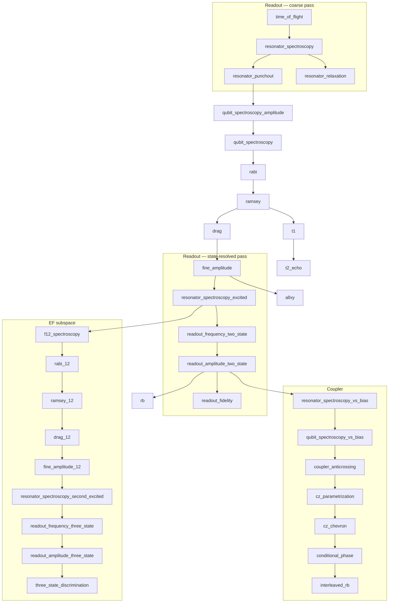

# RFC 0005 — Calibration Graph Completion

- **Status:** Draft
- **Author:** Martin Ahindura
- **Created:** 2026-07-31
- **Depends on:** RFC 0004 (calibrate operation, tuners, routines, the DAG walk)
- **Touches:** `qpi-driver` (Python only — no new operation, no new event type, no
  server or SDK change)

## 1. The idea

RFC 0004 built the machinery and sixteen routines. The machinery is right; the
graph is not finished. Three things say so, and none of them is a matter of taste:

**The device file has parameters nothing produces.** `measure.acq_rotation` and
`measure.acq_threshold` decide the bit of every `meas_level=2` shot — the default
job path — and no routine writes them. The reference `quantify.device.yml` in this
repo does not carry them at all, so the executor falls back to `0.0`/`0.0` and
discriminates on `Re(z) > 0` with no rotation. There is no reason a readout chain
puts the two clouds either side of that line. The same holds for
`measure.integration_time`, `measure.pulse_duration`, `measure.acq_delay` and
`clock_freqs.f12`.

**The hardware config is provisioned for a larger pipeline than the tuner can
fill.** `qpi-driver/py/quantify.hardware.json` declares, per qubit, clocks named
`01`, `12`, `ro`, `ro1`, `ro2`, `ro_2st_opt` and `ro_3st_opt`. The tuner produces
three of those seven. The other four are the state-resolved readout calibration and
the EF subspace, so a chip wired to that config expects them to exist.

**The readout chain cannot all live at the root.** Measuring the resonance with the
qubit in `|1⟩` needs a calibrated π pulse, so proper readout calibration *depends
on* Rabi, which depends on coarse readout. RFC 0004's graph puts readout entirely
above the qubit chain, so it can only ever do the coarse half. This is a topology
error, not a missing experiment, and it is why the missing nodes cannot simply be
appended.

This RFC completes the graph, and adds the one piece of machinery both reference
pipelines lack: a **check** form per node, so staleness is measured rather than
remembered.

## 2. Vocabulary

Extends RFC 0004 §2.

| Term | Meaning |
| --- | --- |
| **Check** | A cheap measurement answering "is this parameter still right?" without re-deriving it. Distinct from the routine's `calibrate` form, which sweeps. |
| **Diagnose** | The recursion that decides how far *up* the graph to re-calibrate when a check fails (Kelly et al.). |
| **Coarse pass** | Readout calibration possible with no qubit control: find the resonators, pick a working power. |
| **State-resolved pass** | Readout calibration that needs a π pulse: the resonance per qubit state, the optimal drive point between them, and the discriminator. |
| **EF subspace** | The `|1⟩`–`|2⟩` transition and its own amplitude, frequency and DRAG parameters. Needed for leakage-aware three-state readout. |

## 3. Background: the reference pipelines

Two prior implementations target this hardware stack, and both are worth reading
for their **node inventory** — hard-won domain knowledge — and not for their
software structure (§11).

- [`tergite-autocalibration`](https://github.com/tergite/tergite-autocalibration) —
  the full pipeline, 32 nodes, `GRAPH_DEPENDENCIES` in `lib/utils/graph.py`.
- [`tergite-tuner`](https://github.com/tergite/tergite-tuner) — a trimmed
  reimplementation of the same graph for *recalibration only*, with
  `DEFAULT_NODE_DAG_EDGES` in `lib/nodes/__init__.py`. It omits the coupler bias
  currents, which is the boundary of what recalibration alone can fix.

### Provenance and licensing

Both are **Apache License 2.0**, © Chalmers Next Labs and the named contributors in
their file headers. qpi is **MIT**. The two are not interchangeable, so the boundary
matters and is recorded here rather than left to be reconstructed later.

**What this RFC takes: facts, not code.** The node names, the dependency edges, the
calibrated parameter names, and the observation that neither package implements a
check/calibrate split. Those describe a physical calibration order and an interface;
they are not expression, and nothing has been copied. §11 lists the parts of their
*design* qpi deliberately rejects, which is the opposite of borrowing.

**If any implementation is ever ported**, the rule is not "rewrite the header":

- Apache 2.0 is not relicensable as MIT. A ported file stays under Apache 2.0, keeps
  its copyright notice and license reference, and must state that it was modified.
- qpi would need a third-party notices file — the tergite repos use `CREDITS.md`;
  qpi has none today — and `LICENSE` would need to say that some files are Apache
  2.0. Apache 2.0 also carries a patent grant and termination clause MIT does not.
- Accepting Apache-2.0 code into an MIT project is a **maintainer's decision**, not
  an implementer's. It should be made deliberately, once, and written down.

Their own tree shows the correct pattern: the two-qubit Clifford utilities under
`tqg_randomized_benchmarking/utils/` are vendored from the DiCarlo lab (© 2016
QuTech, Delft) under MIT, with the upstream header preserved verbatim inside an
otherwise Apache-2.0 repository.

The one place qpi and they could plausibly have converged is randomized
benchmarking, and they have not: `qpi_driver/tuners/utils/clifford.py` builds the
24-element group by exact matrix composition and derives each recovery gate, with no
lookup tables and no borrowed code. Two of the nodes below — `cz_rb`-equivalents —
are the next place that temptation will arise, so the check above is worth repeating
at that point.

Their graphs agree, and both confirm the straddle:

```
n_rabi_oscillations → resonator_spectroscopy_1
                    → ro_frequency_two_state_optimization
                    → ro_amplitude_two_state_optimization
```

Readout amplitude is calibrated **there**, against discrimination fidelity — not by
punchout. `punchout` sits in `EXCLUDED_NODES` in autocalibration, marked standalone.
RFC 0004 makes punchout the producer of `measure.pulse_amp`, which is the weaker
choice; §4 records the decision.

They also calibrate a number RFC 0004 hardcodes. `spec:spec_ampl_optimal` is the
*spectroscopy drive amplitude*, found by a node
(`qubit_bring_up_spectroscopy`). RFC 0004 §11 records that qpi's 1% default is a
signal-to-noise of about five and that the full-DAG test was passing on that
margin; the reference pipelines treat it as a calibrated parameter, and they are
right.

**Neither implements check-vs-calibrate.** Both persist a `calibrated` /
`not_calibrated` flag — autocalibration in redis via
`_check_calibration_status_redis`, and qpi's `RECALIBRATION_ROOTS =
("qubit_spectroscopy",)` is the same idea with the boundary hardcoded instead of
stored. Kelly et al., [*Physical qubit calibration on a directed acyclic
graph*](https://arxiv.org/abs/1803.03226) (arXiv:1803.03226) is the citable
formalism for doing better: per-node `check_data` and `check_state`, and a
`diagnose` recursion that walks up only as far as the evidence requires. This is
the part reviewers will press on hardest, because it is the difference between a
graph and a script.

## 4. Decisions

| Decision | Resolution |
|---|---|
| New operation or event type? | **No.** `calibrate` already carries this. Python driver only. |
| Routine interface | **Unchanged.** `build_schedule` / `analyse` / `apply` absorbs every new node. If a node does not fit, that is a finding to record, not a reason to add a second interface. |
| Where parameters live | **Unchanged** — dotted paths on the real `QuantumDevice`, written to `quantify.device.yml` through the verified write-back. No key–value store. §11. |
| Readout amplitude producer | Move from `resonator_punchout` to `readout_amplitude_two_state`, which optimises it against assignment fidelity. Punchout keeps `clock_freqs.readout` and becomes a **check** node for the dressed regime. |
| Spectroscopy drive amplitude | Becomes a calibrated parameter (`spec.amplitude`) with its own node, replacing the `drive_amp` default. |
| EF subspace | In scope. It is seven nodes and the only route to leakage-aware readout, which the hardware config already expects. |
| Coupler bias current | In scope. `bias.parking_current` is carried, validated and applied today, and set by hand. |
| Check / diagnose | In scope, and first — it needs no new physics and it changes what every other node must provide. |
| Crosstalk | **Out of scope.** Largest, most deferrable, and nothing in the device file depends on it yet. |
| Mixer calibration | **Out of scope.** RF modules; out-of-band like the SPI rack. |
| Code from the reference pipelines | **None.** Facts and interface names only; they are Apache 2.0 and qpi is MIT. Porting any implementation needs a maintainer decision first — §3, *Provenance and licensing*. |

## 5. The gap, concretely

Every readout and qubit parameter the executor or a later routine consumes, and
what produces it today.

| Parameter | Consumed by | Produced today |
|---|---|---|
| `clock_freqs.readout` | every schedule | ✅ `resonator_spectroscopy`, corrected by `resonator_punchout` |
| `clock_freqs.f01` | every drive | ✅ `qubit_spectroscopy` → `ramsey` |
| `clock_freqs.f12` | EF drive, 3-state readout | ❌ nothing — hardcoded in the fixture, 134 MHz from the simulated transmon |
| `clock_freqs.readout_1` / `_2` | readout optimisation | ❌ nothing |
| `clock_freqs.readout_2state_opt` / `_3state_opt` | optimal readout | ❌ nothing |
| `measure.pulse_amp` | every readout | ⚠️ `resonator_punchout` — dressed-regime edge, not fidelity |
| `measure.acq_rotation` | **every `meas_level=2` shot** | ❌ nothing; absent from the reference config → `0.0` |
| `measure.acq_threshold` | **every `meas_level=2` shot** | ❌ nothing; absent from the reference config → `0.0` |
| `measure.integration_time` | every acquisition | ❌ hand-set (3.6 µs) |
| `measure.pulse_duration` | every readout | ❌ hand-set (3.8 µs) |
| `measure.acq_delay` | every acquisition | ❌ hand-set (200 ns) |
| `rxy.amp180`, `rxy.motzoi` | every gate | ✅ `rabi`/`fine_amplitude`, `drag` |
| `r12.ef_amp180`, `r12.ef_motzoi` | EF gates | ❌ nothing |
| `spec.amplitude` | `qubit_spectroscopy` itself | ❌ hardcoded default |
| `cz.square_amp`, `cz.square_duration`, phase corrections | every CZ | ✅ `cz_chevron`, `conditional_phase` |
| `bias.parking_current` | applied at driver startup | ❌ hand-set |

Two of these are worse than "missing": the discriminator pair silently defaults,
and `f12` is silently wrong. A missing parameter that raises is a nuisance; one
that defaults is a wrong answer with no symptom.

## 6. The target graph



`flux_spectroscopy` is subsumed by `qubit_spectroscopy_vs_bias`, which measures the
same arc against a swept coupler bias rather than a pulsed flux offset. Keeping both
would be two names for one experiment.

## 7. Node inventory

Sixteen existing nodes keep their names, dependencies and written parameters except
where §4 says otherwise. The new ones, in dependency order, with the simulator
capability each requires — because a node the simulator cannot pose is a node we
cannot claim.

| Node | Writes | Simulator needs |
|---|---|---|
| `time_of_flight` | `measure.acq_delay` | ✅ a propagation delay before the acquisition window |
| `resonator_relaxation` | — (reports the linewidth) | ✅ the ring-up, already present in `_trace` |
| `qubit_spectroscopy_amplitude` | `spec.amplitude` | nothing new; the line power-broadens already |
| `resonator_spectroscopy_excited` | `clock_freqs.readout_1` | **the dispersive pull** — resonance per qubit state |
| `readout_frequency_two_state` | `clock_freqs.readout_2state_opt` | the pull, plus separation as a function of drive frequency |
| `readout_amplitude_two_state` | `measure.pulse_amp`, `measure.acq_rotation`, `measure.acq_threshold` | blob positions **derived** from the response, plus a readout-chain rotation and offset so `0/0` is not right by construction |
| `readout_fidelity` | — (characterisation) | assignment errors from the overlap of the two distributions |
| `f12_spectroscopy` | `clock_freqs.f12` | the `.12` clock handled; the three-level ladder is already real |
| `rabi_12`, `ramsey_12`, `drag_12`, `fine_amplitude_12` | `r12.ef_amp180`, `clock_freqs.f12`, `r12.ef_motzoi` | drive on the `.12` clock; leakage to `|3⟩` bounded or a fourth level |
| `resonator_spectroscopy_second_excited` | `clock_freqs.readout_2` | a **second** dispersive shift, for `|2⟩` |
| `readout_frequency_three_state`, `readout_amplitude_three_state`, `three_state_discrimination` | `clock_freqs.readout_3state_opt`, `measure_3state.*` | three resolvable clouds, so leakage is a third outcome rather than "not `|0⟩`" |
| `resonator_spectroscopy_vs_bias` | coupler arc via the resonator | resonator frequency responding to coupler bias |
| `qubit_spectroscopy_vs_bias` | coupler arc via the qubit | qubit frequency responding to coupler bias |
| `coupler_anticrossing` | `bias.parking_current` | **a coupler with its own frequency**, not just an exchange rate |
| `cz_parametrization` | CZ operating-point candidates | the above; replaces two of RFC 0004 §7's chosen constants with measured ones |

The bottom four are where RFC 0004 §7's honesty caveat bites hardest: `G_MHZ`,
`FLUX_CURVATURE_GHZ`, `SIDEBAND_GAP_GHZ`, `STARK_SHIFT_MHZ` and `STARK_ASYMMETRY`
are chosen numbers, and a coupler-bias node is exactly the experiment that would
measure two of them. Until the coupler has a frequency of its own, a
`coupler_anticrossing` result reads as "the routine recovers the parking point of a
plausible coupler".

## 8. Check versus calibrate

Every routine gains an optional `check` alongside `calibrate`. The contract:

- `check` runs a **short** schedule and returns a boolean plus a measured margin.
  It may not write parameters.
- `check` is allowed to be absent. A node without one is always treated as stale,
  which is today's behaviour, so this is additive.
- `diagnose(node)` walks: if a node's check passes, stop; if it fails, check its
  dependencies, and recalibrate the shallowest node whose own dependencies all pass.

Two consequences worth stating in advance:

`RECALIBRATION_ROOTS` becomes a fallback rather than the answer, under the name
`RECALIBRATION_SEEDS`. It existed because there was no way to ask whether the
readout is still good, so the answer was hardcoded to "assume it is". With a check
on `resonator_spectroscopy` the graph can decide, and a readout drift stops being
invisible. It does not disappear outright — with no checks anywhere, blame stops at
the seed, which reproduces RFC 0004's behaviour exactly and is what makes the whole
change additive.

Checks make the drift interval cheaper, not just smarter. RFC 0004's drift check
runs benchmarks and infers; a per-node check measures the parameter, so a failure
names the node instead of the qubit.

### The asymmetry that makes it safe

*Unknown is not failure.* A node with no check, or whose check raised, is unknown,
and `diagnose` may not blame it. Without that rule every diagnose would walk to the
root — since most nodes have no check — and a partial recalibration would cost more
than a full one.

The rule has a price, and it is worth naming because it was paid immediately: an
unevaluable check reports **nothing, forever, in silence**. The first version of
`resonator_spectroscopy`'s check read its tolerance from
``measure.readout_linewidth``, a path no transmon element has, so `read_path` raised
`ParameterError` every time and the check was dead on arrival with no failing test.
The guard is a tier-2 test requiring every check schedule to *build and compile*
against a real device, since building is where a check reads what it is judging.

That also settles where the linewidth comes from: a constant with a config override,
because `fit_resonator_spectroscopy` measures a linewidth and nothing stores it —
neither scheduler's transmon has a field for one. §13 asks whether to add one.

## 9. Simulator capabilities

RFC 0004 §7 sets the bar: a routine we cannot pose to the simulator is a routine we
cannot claim works. Completing the graph therefore needs the simulator extended
first, in this order.

1. **Dispersive readout.** Resonance per qubit state (`|0⟩`, `|1⟩`, `|2⟩`), and blob
   positions derived from that response rather than the two hand-placed constants
   `GROUND_IQ`/`EXCITED_IQ`. Those were chosen to straddle `Re = 0`, which makes the
   discriminator's right answer `0/0` *by construction* — so a discriminator routine
   tested against them would rediscover a number we planted. A readout-chain rotation
   and offset is part of this, for the same reason.
2. **A propagation delay**, so `time_of_flight` has something to find.
3. **The `.12` clock**, so the EF chain can be driven. The three-level ladder and
   its leakage are already real; only the clock plumbing is missing.
4. **A coupler with a frequency**, biased by a current, so the flux arcs and the
   parking point are measurements rather than constants.

Items 1 and 4 are the substance. Item 1 reverses a claim RFC 0004 §7 currently
makes — that a dispersive model is unnecessary — and the reversal is correct: it was
unnecessary only because the routines that need it were absent.

## 10. Testing strategy

Extends RFC 0004 §7 rather than replacing it. Three additions:

- **The full-DAG loop test grows with the graph.** `test_calibration_loop.py`
  already requires the report to come back `success` having skipped *no* routine.
  That assertion is what makes a new node's absence a failure, so it stays as an
  equality and every new node joins it.
- **Every new parameter needs a consumer in the test.** A node that writes a value
  nothing later reads proves nothing. `acq_rotation`/`acq_threshold` are the model
  here: the test should calibrate them on a chip whose blobs are *not* at `0/0` and
  then require `meas_level=2` counts to be right — which fails today.
- **`diagnose` gets tier-1 tests.** It is graph logic, so it belongs with
  `test_calibration_dag.py` and needs no simulator: a fabricated graph with scripted
  check outcomes, asserting which nodes were recalibrated.

## 11. What we deliberately do not take from the reference pipelines

Recorded because the temptation is real and the reason is not obvious from reading
them: both packages optimise for physics throughput, and qpi optimises for a
calibration a `process` driver can trust. Where they differ, qpi's choice is
deliberate.

- **A key–value store as the parameter store.** Both write redis fields like
  `"clock_freqs:readout"` — strings, unvalidated, with the device object
  reconstructed from them afterwards. qpi writes dotted paths onto the real
  `QuantumDevice` and persists *that*, so a wrong name raises at the write instead
  of surviving as a key nobody reads. This is what caught `cz.amp`,
  `cz.phase_correction` and `rxy.motzoi`-under-qblox (RFC 0004 §11); a string store
  would have accepted all three.
- **The measurement / analysis / node triple.** Three files and three classes per
  node. qpi's one `CalibrationRoutine` with `build_schedule`, `analyse` and `apply`
  holds the same content where a reader can see it at once, and the DAG needs no
  factory to assemble it.
- **Class discovery by AST crawling.** `NodeFactory` walks the package looking for
  `BaseNode` subclasses and maps snake_case names to them. qpi's `all_routines()` is
  an explicit list; a node that is not in it does not exist, which is the property
  you want when a missing node means an uncalibrated chip.
- **Split sample spaces.** `schedule_samplespace` versus `external_samplespace`
  exists because some sweeps set instrument state between acquisitions. qpi has one
  case of this (the coupler bias) and should handle it explicitly in the routine
  rather than as a second sweep mechanism for every node.

Where qpi is already ahead and must stay so: the write-back is verified by reading
the candidate file back before it replaces anything, keeps the previous file as
`.prev`, and treats a fit outside its own sweep as a failure rather than a
parameter. Every node added here inherits that for free.

## 12. Implementation plan

Ordered so that each phase is independently mergeable and the risky physics comes
after the machinery.

1. ~~**Check / calibrate / diagnose.**~~ **Done.** `CheckOutcome` plus the optional
   `build_check_schedule`/`analyse_check` pair on every routine;
   `CalibrationDAG.check` and `.diagnose`; `recalibrate` now asks rather than
   assumes. Checks implemented for `resonator_spectroscopy` — three points across
   the line, so a readout drift is visible for the first time — and for `rabi`,
   which amplifies the error over five pulses because a single pi pulse is second
   order in its own error and cannot be told apart from a gain change. Tier-1 tests
   for the recursion over a fabricated graph; a tier-2 test that every check
   schedule compiles.
2. **The cheap missing writers.** Partly done.
   - `time_of_flight` → `measure.acq_delay`: **done.** Opens the window *with* the
     readout pulse so the dead time lands inside a raw trace, and recovers 148 ns
     against a true 148 on the simulated chip.
   - `resonator_relaxation`: **done, as a characterisation.** It reports the
     resonator linewidth — which nothing else measures — and deliberately does *not*
     write `measure.integration_time`. The ring-up is a floor on that, not an
     optimum: choosing the optimum trades signal-to-noise against relaxation during
     the window, which needs phase 4's discrimination fidelity. Three time constants
     would have cut the reference config's 1 µs window to 240 ns on a criterion that
     never mentions noise.
   - `qubit_spectroscopy_amplitude`: **blocked**, and the blocker is §13's open
     question rather than effort. There is nowhere to put the value: the transmon
     element has `clock_freqs`, `measure`, `ports`, `pulse_compensation`, `reset` and
     `rxy`, and none of them holds a spectroscopy drive amplitude. Adding one means a
     custom element class and an `element_type` change in every device config, which
     is a decision about the config format rather than a routine to write.
3. **Dispersive readout in the simulator.** Blob positions from the response;
   readout-chain rotation and offset; the `|1⟩` pull. Nothing user-visible, so it
   lands with only simulator tests.
4. **The state-resolved readout pass.** `resonator_spectroscopy_excited`,
   `readout_frequency_two_state`, `readout_amplitude_two_state`,
   `readout_fidelity`. Moves `measure.pulse_amp` off punchout. **This is the phase
   that makes `meas_level=2` calibrated**, and the highest-value one.
5. **The EF subspace.** Seven nodes, plus the `|2⟩` pull and the `.12` clock.
   Unlocks three-state readout and grounds `f12`.
6. **The coupler.** A coupler frequency in the simulator, the two arcs,
   `coupler_anticrossing` → `bias.parking_current`, `cz_parametrization`. Replaces
   two chosen constants with measured ones.

Phases 1–2 are worth doing regardless of how far the rest gets. Phase 4 is the one
whose absence is currently a wrong answer rather than a missing feature.

## 13. Open questions

- **Does `resonator_punchout` survive as a calibrate node at all?** The reference
  pipelines treat it as standalone. If `readout_amplitude_two_state` owns the
  amplitude and `resonator_spectroscopy` owns the frequency, punchout's remaining
  job is a check — "are we still in the dressed regime?" — which may be the honest
  shape for it.
- **Is `readout_fidelity` a node or a report field?** It writes nothing. RFC 0004
  gives benchmarks the same shape (`updates = ()`), so precedent says node.
- **Where does the three-state discriminator live in the device file?** quantify's
  transmon has one `measure` submodule. `measure_2state_opt` / `measure_3state_opt`
  as sibling submodules follows the reference pipelines, but it is a custom element
  extension, like `FluxTunableCoupler` already is.
- **Should the DAG refuse an edge whose qubits are not targeted?** Carried over
  from RFC 0004 §11, still open, and `coupler_anticrossing` makes it sharper: the
  bias current is a property of the edge, measured through its qubits.
